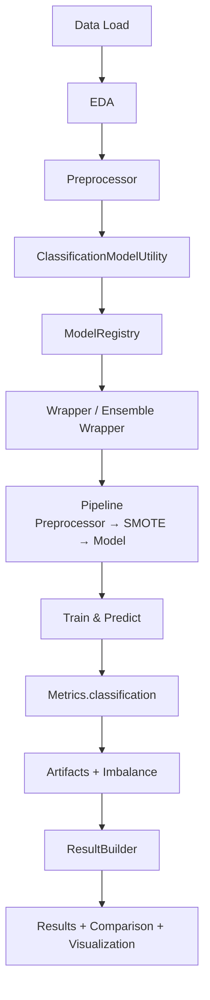

# ML Logistic Regression Pipeline Report

## Overview

This implementation builds a complete end-to-end Machine Learning pipeline and reporting system for classification using the Adult Census Income dataset.
It demonstrates a production-ready ML framework that combines:

- ✅ Exploratory Data Analysis (EDA)
- ✅ Config-driven data preprocessing
- ✅ Wrapper-based model execution
- ✅ Ensemble modeling (Parallel, Sequential, Stacking) ✅
- ✅ SMOTE-based imbalance handling ✅
- ✅ Metrics, artifacts, and observability
- ✅ Visualization and HTML report generation
- ✅ Standardized results via ResultBuilder ✅

---

## 🧱 Architecture Flow



---

## ✅ Key Changes

- ✅ Wrapper-first execution model
- ✅ Ensemble-native design (Voting, Boosting, Stacking)
- ✅ Pipeline-first architecture (SMOTE safe insertion)
- ✅ Artifact-aware evaluation
- ✅ Result standardization via ResultBuilder
- ✅ Baseline vs Ensemble vs Tuned comparison
- ✅ Improved observability (metrics + imbalance tracking)

---

## Key Components

### 1. Data Loading

```python
dl.read_dataset("adultcensusincome.csv")
```

Features:

- Handles unnamed columns
- Optional optimization
- Returns dataset + load report

---

### 2. Exploratory Data Analysis (EDA)

#### Insights Generated

- Missing values detection (? handling)
- Feature cardinality (unique counts)
- Country aggregation
- Correlation analysis

#### Visualizations

- Country distribution (Top 10 + Others)
- Histograms (age, income, education)
- Pie charts (categorical features)
- Bivariate analysis
- Correlation heatmap

---

## Univariate Analysis

Explores individual feature distributions:

- Distribution shape
- Outliers
- Dominant categories

---

## Machine Learning Pipeline

### Data Filtering

```python
df_usa = df[df['native.country'] == 'United-States']
```

Purpose:

- Reduce imbalance
- Improve performance

---

### Preprocessing

#### CustomImputer

- Strategy: mode
- Grouped imputation

#### OutlierHandler

- Method: IQR
- Removes extreme values

---

### Model Utility

```python
cm = ClassificationModelUtility(...)
```

Responsibilities:

- Data preparation
- Pipeline construction
- Wrapper execution
- Ensemble orchestration
- Metrics + artifacts extraction
- Result standardization

---

### Model Training

```python
cm.run_all_models()
```

Runs multiple models:

- Logistic Regression
- Decision Tree
- Random Forest
- KNN
- SVC

---

## Model Evaluation

### Metrics

- Accuracy
- F1 Score
- Precision
- Recall
- ROC-AUC

---

### Ranking & Comparison

```python
cm.rank_models(metric="f1")
cm.compare_models()
```

---

### Results DataFrames

```python
results_df = cm.get_results_df()
artifacts_df = cm.get_artifacts_df()
```

---

## Visualization Layer

Built using **Plotly + ClassificationPlots**

### Plots Included

- Metric comparison (bar chart)
- Best model annotation
- Multi-metric visualization
- ROC curves (multi-model)

---

## Dashboard Construction

Uses:

```python
HtmlBuilder
PlotRenderer
```

### Sections

1. Data Overview
2. EDA Insights
3. Model Performance
4. Visual Analytics Dashboard

---

## Report Generation

```python
ru.save_html_report(...)
```

Outputs:

- HTML report file
- Opens automatically in browser

---

## Performance Tracking

```python
execution_time = end_time - start_time
```

Measures total pipeline time

---

## Design Principles

- ✅ Modular architecture
- ✅ Separation of concerns
- ✅ Reusable components
- ✅ Visualization-first design
- ✅ Production-ready reporting

---

## Best Practices

- Clean dataset before modeling
- Separate artifacts from metrics
- Use formatter for UI rendering
- Avoid heavy datasets in demo runs

---

## Extensibility

Future enhancements:

- Hyperparameter tuning integration
- Multi-label support
- Per-label performance dashboards
- Automated report comparisons

---

## Summary

This script demonstrates a **complete ML reporting pipeline**, combining data analysis, modeling, and visualization into a single automated HTML report. It is designed for scalability, extensibility, and enterprise-level usage.
