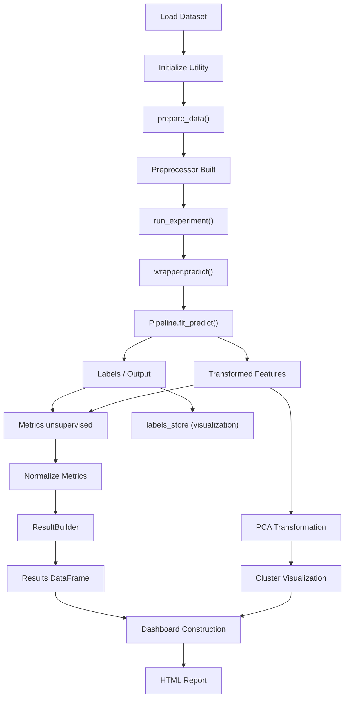

# Unsupervised ML Pipeline Script Documentation

## ✅ Overview

This script demonstrates a complete **unsupervised machine learning pipeline** including:

- Data loading
- Preprocessing
- Model execution using UnsupervisedModelUtility
- Visualization using PCA
- Cluster evaluation
- HTML report generation

---

## 🧱 Architecture Flow



---

## ✅ Key Components

### ✅ Data Layer

- `DataLoader` → Loads dataset
- `DataFrameHelper` → Provides dataset insights

---

### ✅ ML Pipeline

- `UnsupervisedModelUtility`
  - Handles preprocessing
  - Executes models
  - Stores results

- Models used:
  - KMeans
  - DBSCAN

---

### ✅ Preprocessing

- `CustomImputer`
- `OutlierHandler`
- `Preprocessor (unsupervised mode)`

---

### ✅ Visualization Layer

- PCA for dimensionality reduction
- Plotly for cluster visualization

---

### ✅ Reporting Layer

- `HtmlBuilder`
- `PlotRenderer`
- `ReportUtils`

---

## ✅ Execution Flow

### 1. Load Data

```python
df, report = dl.read_dataset(...)
```

---

### 2. Initialize Utility

```python
um = UnsupervisedModelUtility(df, imputer, outlier)
```

---

### 3. Prepare Data

```python
um.prepare_data()
```

---

### 4. Run Models

```python
um.run_experiment("KMeans")
um.run_experiment("DBSCAN")
```

---

### 5. Get Results

```python
results_df = um.get_results_df()
```

---

### 6. Visualization

```python
labels = um.get_labels("KMeans")
```

- PCA Projection
- Cluster scatter plots

---

### 7. Elbow Method

Used to determine optimal cluster count.

---

### 8. Dashboard Generation

- Data summary
- Results table
- Visualizations

---

### 9. HTML Report

```python
ru.save_html_report(...)
```

---

## ✅ Output

- Interactive HTML report
- Cluster visualization charts
- Evaluation metrics table

---

## ✅ Design Principles

- ✅ Clean separation of concerns
- ✅ Pipeline-first design
- ✅ Utility-driven orchestration
- ✅ Visualization decoupled from metrics
- ✅ Reusable architecture

---

## ✅ Best Practices

- Always call `prepare_data()` before execution
- Use registry model names (KMeans, DBSCAN)
- Keep visualization separate from results
- Use processed data for PCA and evaluation

---

## ✅ Final Takeaway

> This script showcases a **complete, production-ready unsupervised ML pipeline** with modular architecture, clean design, and integrated reporting capabilities.
