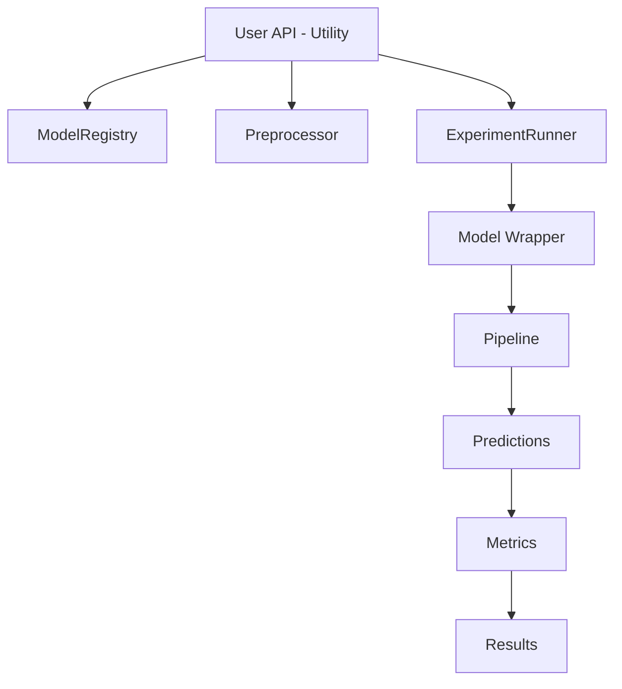
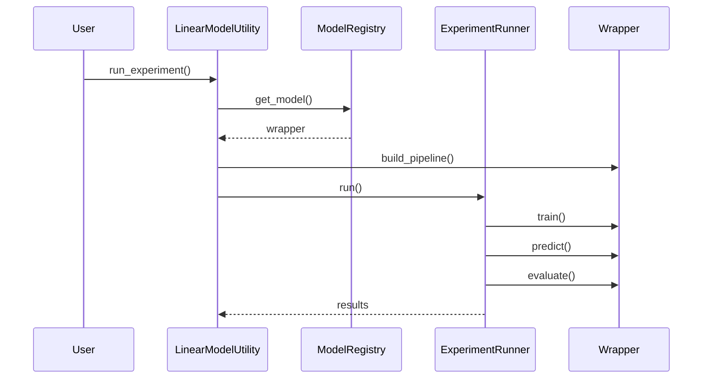

# 🚀 Machine Learning Framework (Modular & Extensible)


---

## 📌 Overview

This repository provides a **modular, scalable, and loosely coupled machine learning framework** designed for:

- Experiment-driven ML workflows
- Rapid prototyping
- Production-grade extensibility

---

## 🧭 Architecture Overview

### 🔷 High-Level Flow



---

### 🔁 Sequence Diagram



---

## 📂 Folder Structure

```
machinelearning/
│
├── base/
│   ├── MLModelBase.py
│   ├── BaseModelWrapper.py
│
├── models/
│   ├── linear/
│       ├── LinearRegressionWrapper.py
│       ├── RidgeWrapper.py
│       ├── LassoWrapper.py
│       ├── ElasticNetWrapper.py
│
├── registry/
│   ├── ModelRegistry.py
│
├── pipeline/
│   ├── Preprocessor.py
│
├── experiment/
│   ├── ExperimentRunner.py
│
├── tuning/
│   ├── HyperparameterTuner.py
│
├── evaluation/
│   ├── Metrics.py
│   ├── ModelComparator.py
│
├── facade/
│   ├── LinearModelUtility.py
│   ├── ClassificationModelUtility.py
```

---

## 🧩 Layer-by-Layer Explanation

### 1. Base Layer (`base/`)

#### MLModelBase

Defines a contract for:

- Data preparation
- Experiment execution
- Model tuning
- Evaluation and comparison

#### BaseModelWrapper

Encapsulates model logic:

- Pipeline building
- Training and prediction
- Model-specific evaluation

```python
wrapper.build_pipeline(preprocessor)
wrapper.train(X_train, y_train)
preds = wrapper.predict(X_test)
metrics = wrapper.evaluate(y_test, preds)
```

---

### 2. Model Layer (`models/`)

Each model has its own wrapper class.

Example:

- LinearRegressionWrapper
- RidgeWrapper
- LassoWrapper
- ElasticNetWrapper

Responsibilities:

- Build pipeline
- Define evaluation metrics

```python
class RidgeWrapper(BaseModelWrapper):
    def build_pipeline(self, preprocessor):
        ...
```

---

### 3. Registry Layer (`registry/`)

#### ModelRegistry

- Stores all available models
- Returns model wrappers
- Enables plug-and-play architecture

```python
registry = ModelRegistry()
model = registry.get_model("Ridge")
```

---

### 4. Pipeline Layer (`pipeline/`)

#### Preprocessor

Builds preprocessing pipeline:

- Numeric scaling
- Categorical encoding
- Optional imputation
- Optional outlier handling

```python
preprocessor = Preprocessor(X, imputer, outlier).build()
```

---

### 5. Experiment Layer (`experiment/`)

#### ExperimentRunner

Handles:

- Training
- Prediction
- Evaluation
- Experiment result tracking

```python
runner.run(model_name, wrapper, X_train, X_test, y_train, y_test)
```

---

### 6. Tuning Layer (`tuning/`)

#### HyperparameterTuner

Supports:

- Grid Search
- Random Search

```python
result = tuner.grid_search(pipeline, param_grid)
```

---

### 7. Evaluation Layer (`evaluation/`)

#### Metrics

Provides:

- Regression metrics (R2, MSE, RMSE)
- Classification metrics (Accuracy, F1)

```python
Metrics.regression(y_true, y_pred)
```

#### ModelComparator

Supports:

- Model ranking
- Best model selection
- Baseline vs tuned comparison

---

### 8. Facade Layer (`facade/`)

#### LinearModelUtility

Main user-facing class:

- Prepare data
- Run experiments
- Perform tuning
- Compare models

#### ClassificationModelUtility

## Similar interface for classification tasks.

## 🧪 Example Usage (End-to-End)

```python
lm = LinearModelUtility(df, target_col="target")

lm.prepare_data()

lm.run_experiment("Ridge")

lm.run_all_models()

lm.grid_search_cv("Ridge", param_grid)

best = lm.get_best_model("R2")
```

---

## 📚 API Documentation

## LinearModelUtility

### prepare_data()

Prepares dataset and builds preprocessing pipeline.

### run_experiment(model_name, k_fold=None)

Runs a single experiment.

### run_all_models()

Runs all models.

### grid_search_cv()

Performs grid search.

---

## BaseModelWrapper

### build_pipeline()

Constructs ML pipeline.

### train()

Fits model.

### predict()

Generates predictions.

---

## ModelRegistry

### get_model(name)

Returns model wrapper.

---

## 🔄 Workflow

1. Initialize utility
2. Prepare data
3. Build preprocessing pipeline
4. Fetch model from registry
5. Run experiment using runner
6. Evaluate and store results

---

## ✅ Key Benefits

- Loose coupling between components
- Highly extensible (add new models easily)
- Reusable pipelines and experiments
- Clean separation of responsibilities
- Production-ready architecture

---

## 🚀 How to Extend

### Add new model

1. Create wrapper in `models/`
2. Register in `ModelRegistry`

### Add new metric

1. Add method in `Metrics.py`

### Add new preprocessing step

1. Modify `Preprocessor.py`

---

## 📌 Summary

This framework follows best practices:

- SOLID principles
- Modular design
- Scalable architecture

It is suitable for:

- Production ML systems
- Rapid experimentation
- Extensible AutoML systems

---
