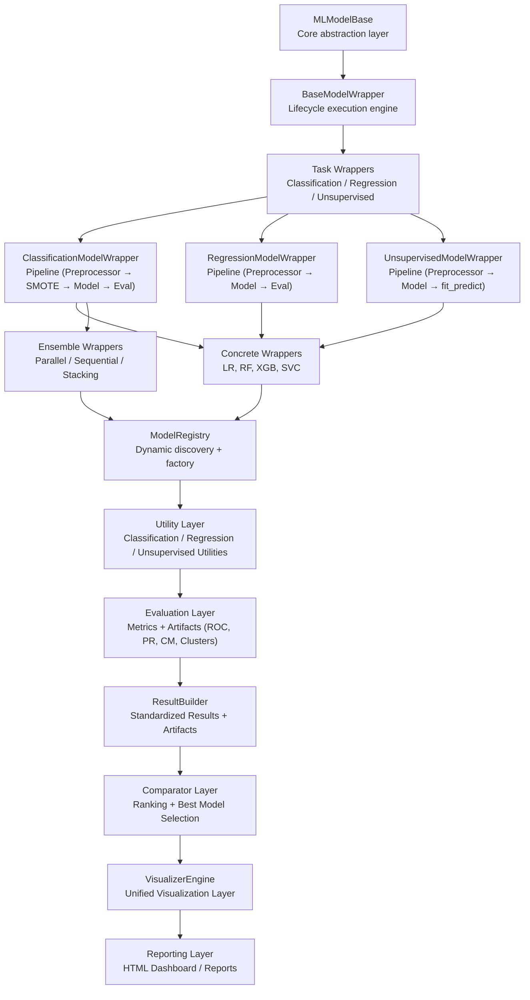
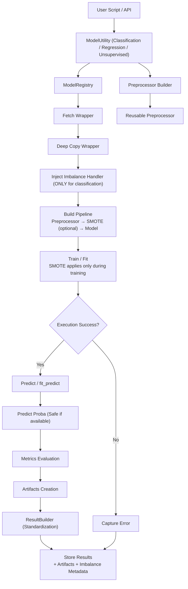
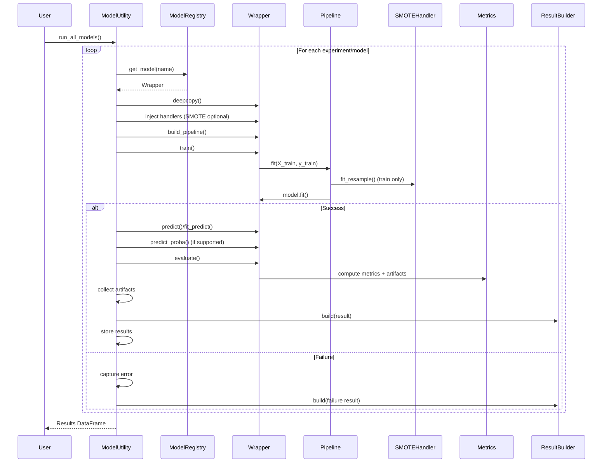
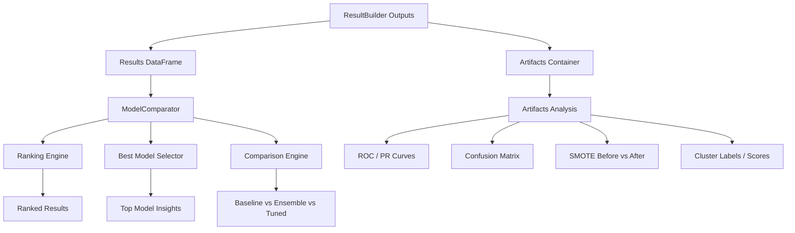
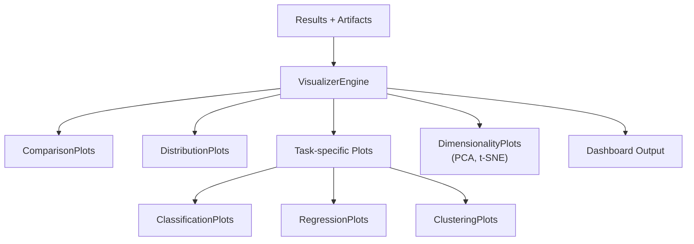
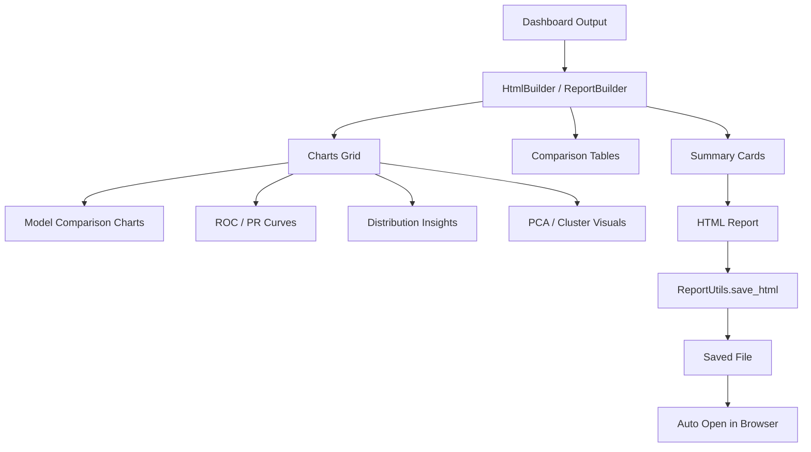

# 🚀 Machine Learning Framework (Modular & Extensible)


---

## 📌 Overview

This repository provides a **modular, scalable, and loosely coupled machine learning framework** designed for:

- Experiment-driven ML workflows
- Rapid prototyping
- Production-grade extensibility
- Unified evaluation + visualization + reporting

---

## 🧭 Architecture Overview

### ML Framework Layered Architecture



### 🔷 High-Level Flow



---

### 🔁 Sequence Diagram



### RESULTS & COMPARISON FLOW



### VISUALIZATION FLOW



### REPORT GENERATION FLOW



---

## 📂 Folder Structure

```
machinelearning/
│
├── README.md
│   # Architecture overview, flows, diagrams, and design principles
│
├── base/
│   ├── MLModelBase.py
│   │   # Core abstraction defining ML lifecycle contract
│   │
│   ├── BaseModelWrapper.py
│   │   # Execution engine managing pipeline + handlers
│   │
│   ├── ClassificationModelWrapper.py
│   │   # Builds classification pipeline (Preprocessor → SMOTE → Model)
│   │
│   ├── RegressionModelWrapper.py
│   │   # Builds regression pipeline (Preprocessor → Model)
│   │
│   ├── UnsupervisedModelWrapper.py
│   │   # Pipeline using fit_predict (clustering + embeddings)
│   │
│   ├── EnsembleModelWrapper.py
│   │   # Base abstraction for ensemble strategies
│   │
│   ├── ParallelEnsembleWrapper.py
│   │   # Voting/Bagging-style parallel ensembling
│   │
│   ├── SequentialEnsembleWrapper.py
│   │   # Boosting-style sequential ensembling
│   │
│   ├── StackingEnsembleWrapper.py
│       # Meta-learner based stacked ensemble
│
├── evaluation/
│   ├── Metrics.py
│   │   # Task-aware metrics + artifact generation (ROC, PR, CM, etc.)
│   │
│   ├── MetricResolver.py
│   │   # Selects default/best metric and direction dynamically
│   │
│   ├── BaseComparator.py
│   │   # Abstract comparator base (sorting + ranking contracts)
│   │
│   ├── ModelComparator.py
│   │   # Generic comparison engine across experiments
│   │
│   ├── ClassificationModelComparator.py
│   │   # Ranking + best model selection for classification
│   │
│   ├── RegressionModelComparator.py
│   │   # Regression ranking (R², RMSE, MAE with direction awareness)
│   │
│   ├── UnsupervisedModelComparator.py
│   │   # Clustering comparison (silhouette, DBI, etc.)
│   │
│   └── METRICS.md
│       # Documentation for metrics + artifacts structure
│
├── facade/
│   ├── ClassificationModelUtility.py
│   │   # End-to-end orchestration for classification workflows
│   │
│   ├── RegressionModelUtility.py
│   │   # Orchestration for regression workflows
│   │
│   ├── UnsupervisedModelUtility.py
│   │   # Orchestration using fit_predict (no target required)
│   │
│   ├── CLASSIFICATIONMODELUTILITY.md
│   │   # Full lifecycle documentation for classification
│   │
│   ├── RegressionModelUtility.md
│   │   # Workflow documentation for regression
│   │
│   └── UNSUPERVISEDMODELUTILITY.md
│       # Full lifecycle + flow diagrams for unsupervised
│
├── models/
│   ├── __init__.py
│   │   # Entry point for wrapper auto-registration
│   │
│   ├── classification/
│   │   ├── __init__.py
│   │   │   # Registers classification wrappers
│   │   ├── LogisticRegressionWrapper.py
│   │   ├── DecisionTreeClassifierWrapper.py
│   │   ├── RandomForestWrapper.py
│   │   ├── KNNClassifierWrapper.py
│   │   ├── SVCWrapper.py
│   │   └── XGBoostWrapper.py
│   │       # task="classification", grouped by family
│   │
│   ├── regression/
│   │   ├── __init__.py
│   │   │   # Registers regression wrappers
│   │   ├── LinearRegressionWrapper.py
│   │   ├── RidgeWrapper.py
│   │   ├── LassoWrapper.py
│   │   └── ElasticNetWrapper.py
│   │       # task="regression", linear family
│   │
│   └── unsupervised/
│       ├── __init__.py
│       │   # Registers clustering & dimensionality wrappers
│       ├── KMeansWrapper.py
│       ├── DBSCANWrapper.py
│       ├── AgglomerativeWrapper.py
│       ├── PCAWrapper.py
│       └── TSNEWrapper.py
│
├── pipeline/
│   ├── Preprocessor.py
│   │   # Builds reusable preprocessing pipeline
│   │
│   ├── imbalance/
│   │   ├── BaseImbalanceHandler.py
│   │   │   # Abstraction for imbalance strategies
│   │   ├── SMOTEHandler.py
│   │   │   # Oversampling + before/after tracking
│   │   ├── SMOTEENNHandler.py
│   │   │   # Combined over + under sampling strategy
│   │   └── ImbalanceFactory.py
│   │       # Config-driven imbalance resolver
│   │
│   ├── CustomImputer.py
│   │   # Missing value handling (group-aware)
│   │
│   ├── OutlierHandler.py
│   │   # Outlier transformation (no row removal)
│   │
│   ├── CustomImputer.md
│   └── OutlierHandler.md
│       # Documentation for pipeline components
│
├── registry/
│   └── ModelRegistry.py
│       # Dynamic wrapper discovery (task + family aware)
│
├── shared/
│   ├── DataCleaner.py
│   │   # Normalizes and flattens model outputs
│   │
│   ├── Formatter.py
│   │   # Standardizes experiment naming
│   │
│   ├── ClassificationFormatter.py
│   │   # Formats classification artifacts (ROC, PR, CM)
│   │
│   └── ResultBuilder.py
│       # Unified result schema (metrics + artifacts)
│
├── tuning/
│   ├── HyperparameterTuner.py
│   │   # Regression tuning (correct scoring strategy)
│   │
│   ├── ClassificationHyperparameterTuner.py
│   │   # Wrapper-based tuning with SMOTE-awareness
│   │
│   └── HyperparameterTuner.md
│       # Documentation for tuning workflows
│
├── visualization/
│   ├── core/
│   │   └── VisualizerEngine.py
│   │       # Central orchestrator for all visualizations
│   │
│   ├── generic/
│   │   ├── ComparisonPlots.py
│   │   │   # Task-agnostic comparison + ranking visuals
│   │   └── DistributionPlots.py
│   │       # Metric, class, residual, cluster distributions
│   │
│   ├── classification/
│   │   └── ClassificationPlots.py
│   │       # ROC, PR, multi-metric, classification visuals
│   │
│   ├── regression/
│   │   └── RegressionPlots.py
│   │       # R², RMSE, regression comparison plots
│   │
│   ├── unsupervised/
│   │   ├── ClusteringPlots.py
│   │   │   # Clustering metrics + cluster comparisons
│   │   └── DimensionalityPlots.py
│   │       # PCA / t-SNE embedding visualizations
│   │
│   └── advanced/
│       ├── HyperparameterPlots.py
│       │   # Tuning trends + parameter-performance plots
│       └── OptimizationPlots.py
│           # Optimization progress + convergence analysis
│
└── reports/
    └── report_utils.py
        # HTML report generation and export utilities

```

---

## ✅ Core Layers

| Layer         | Responsibility                                                                                |
| ------------- | --------------------------------------------------------------------------------------------- |
| Utility       | End-to-end orchestration (classification, regression, unsupervised, ensembles, tuning)        |
| Registry      | Dynamic model discovery, filtering (task + family), and wrapper resolution                    |
| Wrapper       | Pipeline construction + execution (Preprocessor → Imbalance → Model / Ensemble / fit_predict) |
| Pipeline      | Feature engineering (Imputer, Encoder, Transformer, Outlier handling)                         |
| Imbalance     | Class imbalance handling (SMOTE, SMOTEENN, future strategies — training only)                 |
| Metrics       | Evaluation layer (task-aware metrics + artifact generation: ROC, PR, CM, clusters)            |
| ResultBuilder | Unified result + artifact schema (metrics + metadata + imbalance summary)                     |
| Comparator    | Model ranking, comparison, and best model selection (metric-aware, direction-aware)           |
| Tuner         | Hyperparameter optimization (grid/random/CV, wrapper-aware, imbalance-aware)                  |
| Visualization | ✅ Centralized visualization via VisualizerEngine (comparison, distribution, task-specific)   |
| Reporting     | HTML dashboard generation (charts, summaries, artifact visualization)                         |

---

## 🚀 End-to-End Flow

````python
# ✅ Initialize utility
cm = ClassificationModelUtility(
    df,
    target_col,
    imputer=CustomImputer(...),
    outlier_handler=OutlierHandler(...),
    imbalance_config=imbalance_config
)

# ✅ Prepare data (split + reusable preprocessor)
cm.prepare_data()

# ✅ Run baseline models
cm.run_all_models()

# ✅ Run ensemble models
cm.run_ensemble({
    "type": "parallel",
    "method": "voting",
    "model_names": ["LogisticRegression", "RandomForestClassifier", "XGBoost"]
})

# ✅ Hyperparameter tuning
cm.tune_model("RandomForestClassifier", param_config)

# ✅ Get standardized results
results_df = cm.get_results_df()

# ✅ Visualization (UPDATED ✅)
viz = VisualizerEngine(cm.results, cm.artifacts)
dashboard = viz.render_all()
```
---

## 🚀 End-to-End Flow

```python
# ✅ Initialize utility
cm = ClassificationModelUtility(
    df,
    target_col,
 (split + preprocessing pipeline)    imbalance_config=imbalance_config
cm.prepare_data()

# ✅ Run baseline models
cm.run_all_models()

# ✅ Run ensemble models ✅
cm.run_ensemble({
    "type": "parallel",
    "method": "voting",
    "model_names": ["LogisticRegression", "RandomForestClassifier", "XGBoost"]
})

# ✅ Hyperparameter tuning
cm.tune_model("RandomForestClassifier", param_config)

# ✅ Get standardized results (ResultBuilder ✅)
results = cm.get_results_df()
)

````

---

## Unified Execution Flow

```
prepare_data()
↓
Reusable Preprocessor (compiled once)
↓
run_all_models / run_ensemble / tune_model
↓
Wrapper Layer → Pipeline Construction
↓
(Optional) Imbalance Handler (SMOTE for classification only)
↓
Model / Ensemble / fit_predict (unsupervised)
↓
Metrics Computation (task-aware)
↓
Artifacts Creation (ROC, PR, clusters, etc.)
↓
ResultBuilder (standardization)
↓
Results + Artifacts
↓
Comparator (ranking + best model)
↓
VisualizerEngine
↓
Dashboard Output

```

## Classification Flow

```

ClassificationModelUtility
↓
Wrapper-based Pipeline
↓
SMOTE / Imbalance (if configured, training only)
↓
Model / Ensemble (Voting / Stacking / Boosting)
↓
Metrics.classification
↓
ROC / PR / Confusion Matrix
↓
Imbalance Summary (before vs after)
↓
ResultBuilder (results + artifacts)
↓
VisualizerEngine

```

## Regression Flow

```

RegressionModelUtility
↓
Wrapper-based Pipeline
↓
(No Imbalance Layer)
↓
Regression Models
↓
Metrics.regression
↓
R² / RMSE / MAE
↓
Artifacts (residuals, etc.)
↓
ResultBuilder
↓
VisualizerEngine

```

## Unsupervised Flow

```
UnsupervisedModelUtility
↓
Preprocessor (no target)
↓
Wrapper Pipeline
↓
fit_predict()
↓
Cluster Labels / Embeddings
↓
Metrics.unsupervised (Silhouette, DBI, etc.)
↓
Artifacts (labels, PCA, t-SNE)
↓
ResultBuilder
↓
VisualizerEngine (Clustering + Dimensionality)
```

---

## ✅ Design Principles

- ✅ Separation of concerns
  → Clear boundaries between layers:
  `Utility → Wrapper → Pipeline → Evaluation → Results → Visualization`
- ✅ Loose coupling
  → Components interact via well-defined contracts (wrappers, registry, ResultBuilder), enabling independent evolution
- ✅ Extensibility
  → Plug-and-play support for:

        Ensemble strategies (Parallel, Sequential, Stacking)
        Imbalance techniques (SMOTE, SMOTEENN, etc.)
        Custom pipelines and transformers

- ✅ Pipeline-First Architecture
  → All execution follows a consistent, reusable flow:

         Preprocessor → Imbalance Handler → Model / Ensemble

- ✅ Unified Result Standardization
  → ResultBuilder ensures consistent schema across:

        Baseline
        Ensemble
        Tuned models

- ✅ Config-Driven Flexibility
  → Behavior controlled via configuration (models, ensembles, imbalance, tuning)
- ✅ Task-Aware Design
  → Built-in tracking of:

        Metrics (accuracy, F1, etc.)
        Artifacts (ROC, PR, Confusion Matrix)
        Imbalance effects (before vs after SMOTE)

- ✅ Production-ready

---

## ✅ Future Scope

- AutoML orchestrator
- Multi-metric tuning
- Explainability integration
- Interactive dashboards (filters, drill-down)
- Model monitoring + drift detection

---

## ✅ Summary

This framework is now:

- 🚀 Production-ready
- 🚀 AutoML-compatible
- 🚀 Fully modular
- 🚀 Architecturally clean
- 🚀 Experiment-driven
