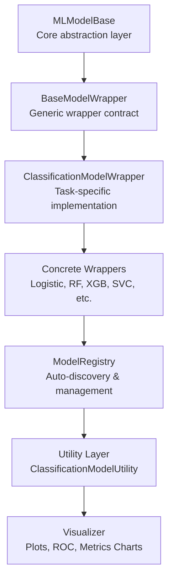
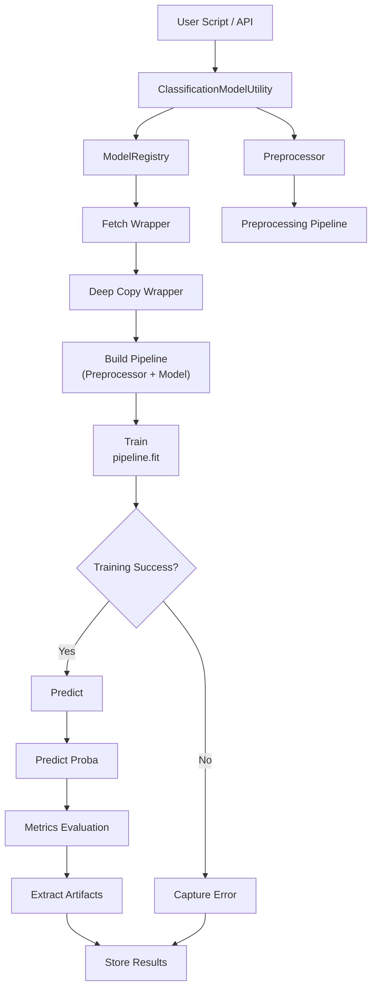
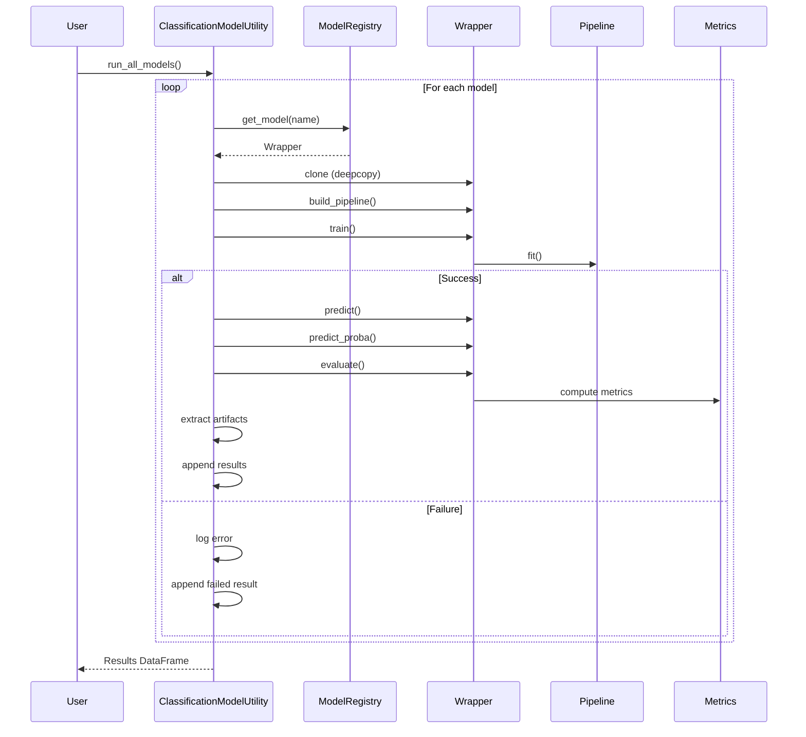
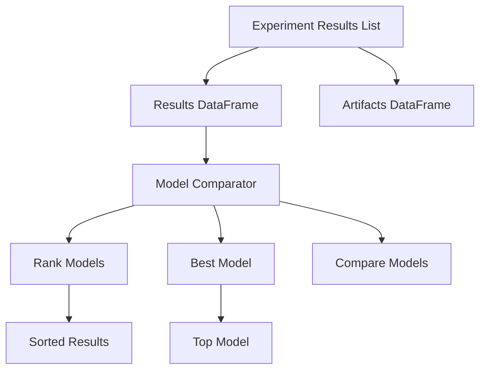
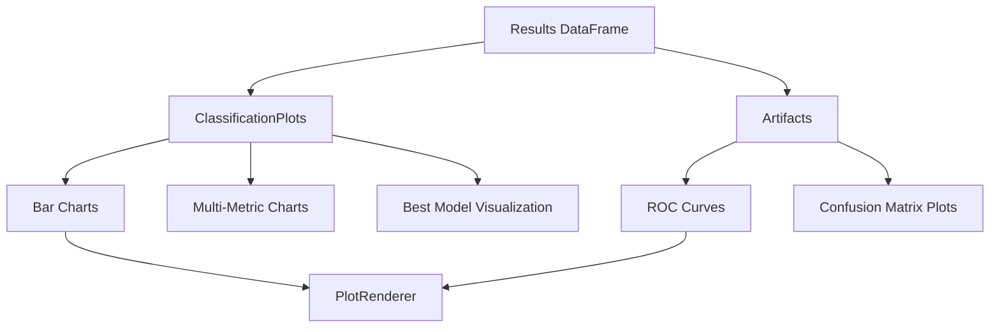
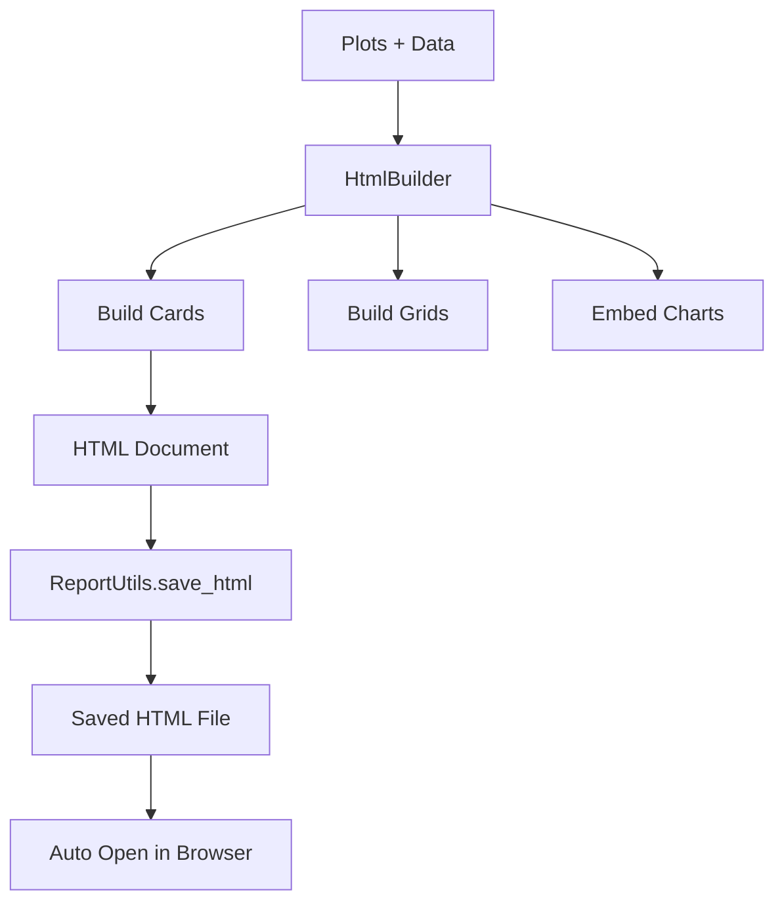

# 🚀 Machine Learning Framework (Modular & Extensible)


---

## 📌 Overview

This repository provides a **modular, scalable, and loosely coupled machine learning framework** designed for:

- Experiment-driven ML workflows
- Rapid prototyping
- Production-grade extensibility

---

## 🧭 Architecture Overview

### ML Framework Layered Architecture



### 🔷 High-Level Flow



---

### 🔁 Sequence Diagram



### RESULTS & COMPARISON FLOW



### VISUALIZATION FLOW



### REPORT GENERATION FLOW



---

## 📂 Folder Structure

```
machinelearning/
│
├── README.md
│   # ✅ Updated: Wrapper-driven architecture + end-to-end flow + AutoML-ready
│
├── base/
│   ├── MLModelBase.py
│   │   # ✅ Core abstraction (train / predict / evaluate contract)
│   │
│   ├── BaseModelWrapper.py
│   │   # ✅ Central wrapper (pipeline + lifecycle execution)
│   │
│   ├── ClassificationModelWrapper.py
│   │   # ✅ Classification wrapper (predict_proba + classification metrics)
│   │
│   ├── LinearRegressionModelWrapper.py
│       # ✅ Regression wrapper (regression-only evaluation)
│
├── evaluation/
│   ├── Metrics.py
│   │   # ✅ PURE metrics layer (classification vs regression separated)
│   │
│   ├── METRICS.md
│   │   # ✅ Updated (artifact separation + task-aware metrics)
│   │
│   ├── ModelComparator.py
│   │   # ✅ Generic comparison logic (experiment-level comparison)
│   │
│   ├── ClassificationModelComparator.py
│       # ✅ Classification ranking + best model selection
│
├── facade/
│   ├── ClassificationModelUtility.py
│   │   # ✅ Classification orchestration (wrapper-driven + artifact-aware)
│   │
│   ├── CLASSIFICATIONMODELUTILITY.md
│   │   # ✅ Updated (pipeline + metrics + artifacts + tuning flow)
│   │
│   ├── LinearModelUtility.py
│   │   # ✅ Regression orchestration (correct scoring + wrapper-based)
│   │
│   ├── LinearModelUtility.md
│       # ✅ Updated (regression separation + tuning fix)
│
├── models/
│   ├── __init__.py
│   │   # ✅ Model discovery entry (auto-registration)
│   │
│   ├── classification/
│   │   ├── __init__.py
│   │   │   # ✅ Registers classification models
│   │   │
│   │   ├── LogisticRegressionWrapper.py
│   │   ├── DecisionTreeClassifierWrapper.py
│   │   ├── RandomForestWrapper.py
│   │   ├── KNNClassifierWrapper.py
│   │   ├── SVCWrapper.py
│   │       # ✅ All implement: task="classification", family="*"
│   │
│   ├── linear/
│       ├── __init__.py
│       │   # ✅ Registers regression models
│       │
│       ├── LinearRegressionWrapper.py
│       ├── RidgeWrapper.py
│       ├── LassoWrapper.py
│       ├── ElasticNetWrapper.py
│           # ✅ All implement: task="regression", family="linear"
│
├── pipeline/
│   ├── Preprocessor.py
│   │   # ✅ PIPELINE BUILDER (not executor)
│   │   # ✅ Combines: Imputer → Outlier → Transformer
│   │
│   ├── CustomImputer.py
│   │   # ✅ Missing value handler (group-aware + results_ logging)
│   │
│   ├── CustomImputer.md
│   │   # ✅ Updated (framework integration + pipeline safety)
│   │
│   ├── OutlierHandler.py
│   │   # ✅ Outlier handler (IQR/Z-score, no row deletion)
│   │
│   ├── OutlierHandler.md
│       # ✅ Updated (pipeline compatibility + logging)
│
├── registry/
│   ├── ModelRegistry.py
│       # ✅ Wrapper discovery engine
│       # ✅ Task-aware (classification / regression)
│       # ✅ Family-aware (linear / tree / boosting)
│
├── shared/
│   ├── DataCleaner.py
│   │   # ✅ CV results flattening + cleanup
│   │
│   ├── Formatter.py
│   │   # ✅ Experiment naming (standardized format)
│   │
│   ├── ClassificationFormatter.py
│       # ✅ Artifact formatting (ROC / PR / CM → DataFrame/UI)
│
├── tuning/
│   ├── HyperparameterTuner.py
│   │   # ✅ REGRESSION tuner
│   │   # ✅ FIXED: scoring = neg_mean_squared_error
│   │
│   ├── HyperparameterTuner.md
│   │   # ✅ Updated (regression-only tuning flow)
│   │
│   ├── ClassificationHyperparameterTuner.py
│       # ✅ Classification tuner
│       # ✅ Wrapper-based execution + artifact-aware output
│
├── visualization/
│   ├── README.md
│   │   # ✅ Visualization architecture overview
│   │
│   ├── core/
│   │   ├── MetricResolver.py
│   │       # ✅ Dynamically selects best metrics for plots
│   │
│   ├── generic/
│   │   ├── ClassificationPlots.py
│   │   │   # ✅ Core plots (ROC, PR, multi-metric, comparisons)
│   │   │
│   │   ├── CLASSIFICATIONPLOTS.md
│   │   │   # ✅ Visualization documentation
│   │   │
│   │   ├── ModelPerformanceVisualizer.py
│   │   │   # ✅ Visual orchestration layer (results + artifacts)
│   │   │
│   │   ├── ModelPerformanceVisualizer.md
│   │       # ✅ Updated visualization docs
│   │
│   ├── advanced/
│       ├── ComparisonPlots.py
│       │   # ✅ Baseline vs tuned comparison
│       │
│       ├── HyperparameterPlots.py
│       │   # ✅ Grid / Random search visualization
│       │
│       ├── OptimizationPlots.py
│           # ✅ Optimization trends & performance curves
```

---

## ✅ Core Layers

| Layer        | Responsibility         |
| ------------ | ---------------------- |
| Utility      | Orchestration          |
| Registry     | Model discovery        |
| Wrapper      | Pipeline + model       |
| Preprocessor | Feature transformation |
| Metrics      | Evaluation             |
| Tuner        | Optimization           |

---

## ✅ Key Improvements

- ✅ Wrapper-driven architecture
- ✅ Regression vs classification separation
- ✅ Fixed scoring bug in tuning
- ✅ Artifact-aware design
- ✅ Experiment-level tracking

---

## 🚀 End-to-End Flow

```python
lm = LinearModelUtility(df, "target")
lm.prepare_data()
lm.run_all_models()
lm.tune_model("Ridge", param_grid)
results = lm.get_results_df()
```

---

## ✅ Classification Flow

```
ClassificationModelUtility → Metrics.classification → ROC / CM
```

## ✅ Regression Flow

```
LinearModelUtility → Metrics.regression → R2 / MSE
```

---

## ✅ Key Fixes Implemented

- ❌ Removed misuse of classification scoring in regression
- ✅ Enforced proper scoring in tuner
- ✅ Fixed empty tuning results issue

---

## ✅ Design Principles

- ✅ Separation of concerns
- ✅ Loose coupling
- ✅ Extensibility
- ✅ Production-ready

---

## ✅ Future Scope

- AutoML orchestrator
- Multi-metric tuning
- Explainability integration

---

## ✅ Summary

This framework is now:

🚀 Production-ready
🚀 AutoML-compatible
🚀 Fully modular
🚀 Architecturally clean
