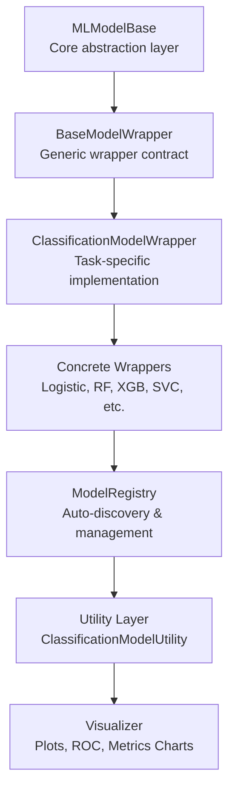
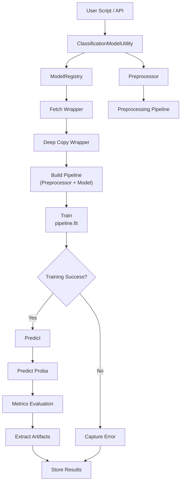
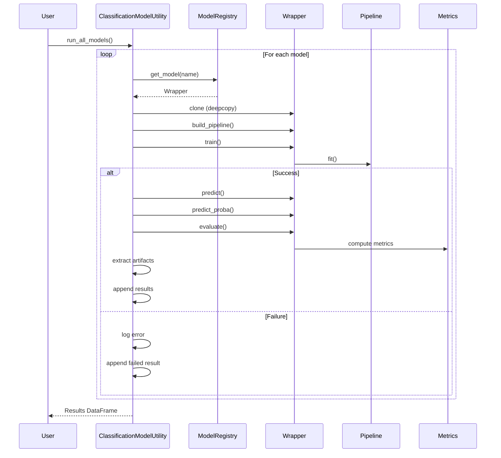
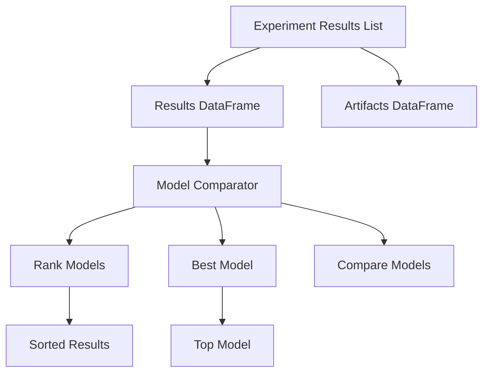
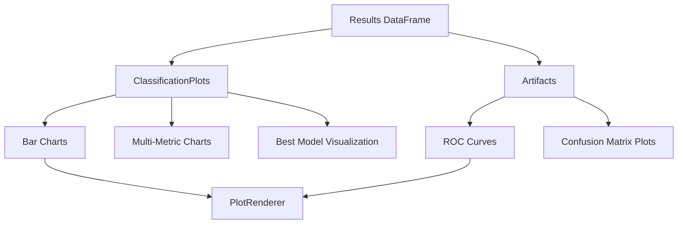
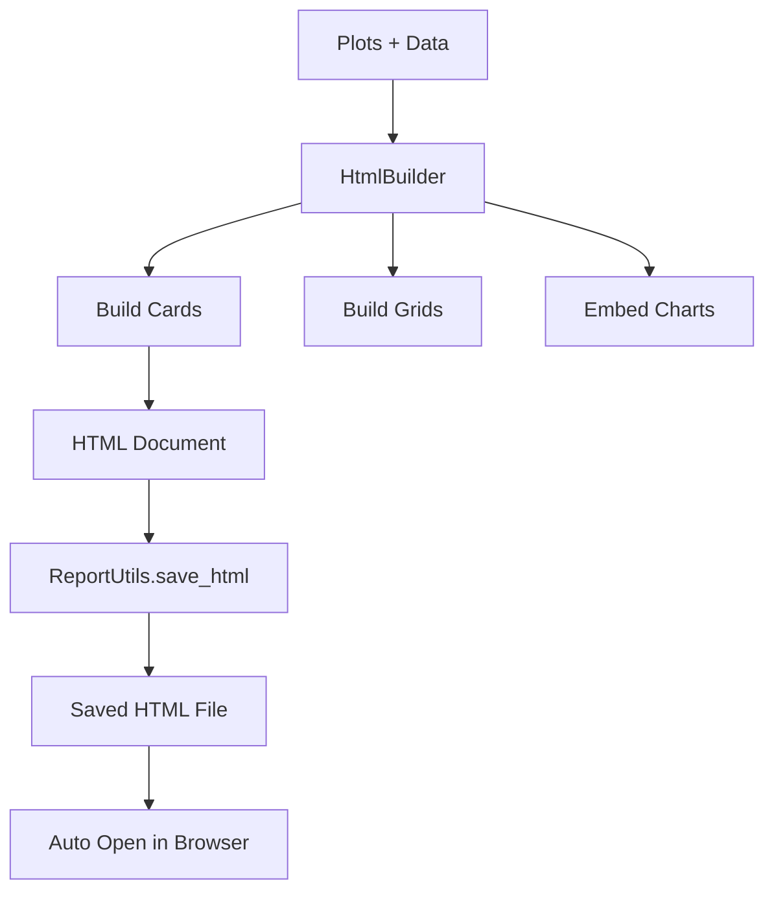

# 🚀 Machine Learning Framework (Modular & Extensible)


---

## 📌 Overview

This repository provides a **modular, scalable, and loosely coupled machine learning framework** designed for:

- Experiment-driven ML workflows
- Rapid prototyping
- Production-grade extensibility

---

## 🧭 Architecture Overview

### ML Framework Layered Architecture



### 🔷 High-Level Flow



---

### 🔁 Sequence Diagram



### RESULTS & COMPARISON FLOW



### VISUALIZATION FLOW



### REPORT GENERATION FLOW



---

## 📂 Folder Structure

```
machinelearning/
│
├── README.md
│   # ✅ High-level overview of ML framework, architecture, usage
│
├── base/
│   ├── MLModelBase.py
│   │   # ✅ Abstract base class defining common ML interface (train, predict, pipeline)
│   │
│   ├── BaseModelWrapper.py
│   │   # ✅ Generic wrapper for pipeline + model integration
│   │
│   ├── ClassificationModelWrapper.py
│   │   # ✅ Wrapper specialized for classification models
│   │
│   ├── LinearRegressionModelWrapper.py
│       # ✅ Wrapper specialized for regression models
│
├── evaluation/
│   ├── Metrics.py
│   │   # ✅ Core computation engine (accuracy, f1, roc, etc.)
│   │
│   ├── METRICS.md
│   │   # ✅ Documentation for Metrics logic and usage
│   │
│   ├── ModelComparator.py
│   │   # ✅ Generic comparator for ranking models (shared logic)
│   │
│   ├── ClassificationModelComparator.py
│       # ✅ Classification-specific ranking, best model selection
│
├── facade/
│   ├── ClassificationModelUtility.py
│   │   # ✅ Main orchestration layer (classification pipeline: train, eval, tuning)
│   │
│   ├── CLASSIFICATIONMODELUTILITY.md
│   │   # ✅ Detailed documentation (flow, usage, architecture)
│   │
│   ├── LinearModelUtility.py
│   │   # ✅ Orchestration layer for regression workflows
│   │
│   ├── LinearModelUtility.md
│       # ✅ Documentation for regression utility
│
├── models/
│   ├── __init__.py
│   │   # ✅ Module initialization
│   │
│   ├── classification/
│   │   ├── __init__.py
│   │   │   # ✅ Registers classification models
│   │   │
│   │   ├── LogisticRegressionWrapper.py
│   │   │   # ✅ Wrapper for Logistic Regression
│   │   │
│   │   ├── DecisionTreeClassifierWrapper.py
│   │   │   # ✅ Wrapper for Decision Tree
│   │   │
│   │   ├── RandomForestWrapper.py
│   │   │   # ✅ Wrapper for Random Forest
│   │   │
│   │   ├── KNNClassifierWrapper.py
│   │   │   # ✅ Wrapper for KNN
│   │   │
│   │   ├── SVCWrapper.py
│   │       # ✅ Wrapper for Support Vector Classifier
│   │
│   ├── linear/
│       ├── __init__.py
│       │   # ✅ Registers regression models
│       │
│       ├── LinearRegressionWrapper.py
│       │   # ✅ Linear Regression model wrapper
│       │
│       ├── RidgeWrapper.py
│       │   # ✅ Ridge model wrapper
│       │
│       ├── LassoWrapper.py
│       │   # ✅ Lasso model wrapper
│       │
│       ├── ElasticNetWrapper.py
│           # ✅ ElasticNet model wrapper
│
├── pipeline/
│   ├── Preprocessor.py
│   │   # ✅ Builds full preprocessing pipeline (encoding, scaling, etc.)
│   │
│   ├── CustomImputer.py
│   │   # ✅ Handles missing values with advanced grouped strategies
│   │
│   ├── CustomImputer.md
│   │   # ✅ Documentation for imputation logic
│   │
│   ├── OutlierHandler.py
│   │   # ✅ Handles outliers (IQR, z-score, etc.)
│   │
│   ├── OutlierHandler.md
│       # ✅ Documentation for outlier handling
│
├── registry/
│   ├── ModelRegistry.py
│       # ✅ Central registry for model discovery & dynamic loading
│
├── shared/
│   ├── DataCleaner.py
│   │   # ✅ Cleans DataFrame (NaN handling, filtering for plots/metrics)
│   │
│   ├── Formatter.py
│   │   # ✅ Generic formatter interface (base formatting utilities)
│   │
│   ├── ClassificationFormatter.py
│       # ✅ Formats classification artifacts (CM, ROC, PR → DataFrame/UI)
│
├── tuning/
│   ├── HyperparameterTuner.py
│   │   # ✅ Generic hyperparameter tuning engine (grid/random)
│   │
│   ├── HyperparameterTuner.md
│   │   # ✅ Documentation for tuning strategies
│   │
│   ├── ClassificationHyperparameterTuner.py
│       # ✅ Classification-specific tuning logic and evaluation hooks
│
├── visualization/
│   ├── README.md
│   │   # ✅ Visualization module overview and usage
│   │
│   ├── core/
│   │   ├── MetricResolver.py
│   │       # ✅ Dynamically resolves best metrics for plotting
│   │
│   ├── generic/
│   │   ├── ClassificationPlots.py
│   │   │   # ✅ Core visualization (bar, scatter, ROC, multi-metric)
│   │   │
│   │   ├── CLASSIFICATIONPLOTS.md
│   │   │   # ✅ Documentation for classification visualizations
│   │   │
│   │   ├── ModelPerformanceVisualizer.py
│   │   │   # ✅ Generic visualization wrapper for results
│   │   │
│   │   ├── ModelPerformanceVisualizer.md
│   │       # ✅ Documentation for visualizer layer
│   │
│   ├── advanced/
│       ├── ComparisonPlots.py
│       │   # ✅ Advanced model comparison visualizations
│       │
│       ├── HyperparameterPlots.py
│       │   # ✅ Visualize tuning results (grid/random search)
│       │
│       ├── OptimizationPlots.py
│           # ✅ Visualize optimization trends & performance curves
```

---

## ✅ Core Layers

| Layer        | Responsibility         |
| ------------ | ---------------------- |
| Utility      | Orchestration          |
| Registry     | Model discovery        |
| Wrapper      | Pipeline + model       |
| Preprocessor | Feature transformation |
| Metrics      | Evaluation             |
| Tuner        | Optimization           |

---

## ✅ Key Improvements

- ✅ Wrapper-driven architecture
- ✅ Regression vs classification separation
- ✅ Fixed scoring bug in tuning
- ✅ Artifact-aware design
- ✅ Experiment-level tracking

---

## 🚀 End-to-End Flow

```python
lm = LinearModelUtility(df, "target")
lm.prepare_data()
lm.run_all_models()
lm.tune_model("Ridge", param_grid)
results = lm.get_results_df()
```

---

## ✅ Classification Flow

```
ClassificationModelUtility → Metrics.classification → ROC / CM
```

## ✅ Regression Flow

```
LinearModelUtility → Metrics.regression → R2 / MSE
```

---

## ✅ Key Fixes Implemented

- ❌ Removed misuse of classification scoring in regression
- ✅ Enforced proper scoring in tuner
- ✅ Fixed empty tuning results issue

---

## ✅ Design Principles

- ✅ Separation of concerns
- ✅ Loose coupling
- ✅ Extensibility
- ✅ Production-ready

---

## ✅ Future Scope

- AutoML orchestrator
- Multi-metric tuning
- Explainability integration

---

## ✅ Summary

This framework is now:

🚀 Production-ready
🚀 AutoML-compatible
🚀 Fully modular
🚀 Architecturally clean
