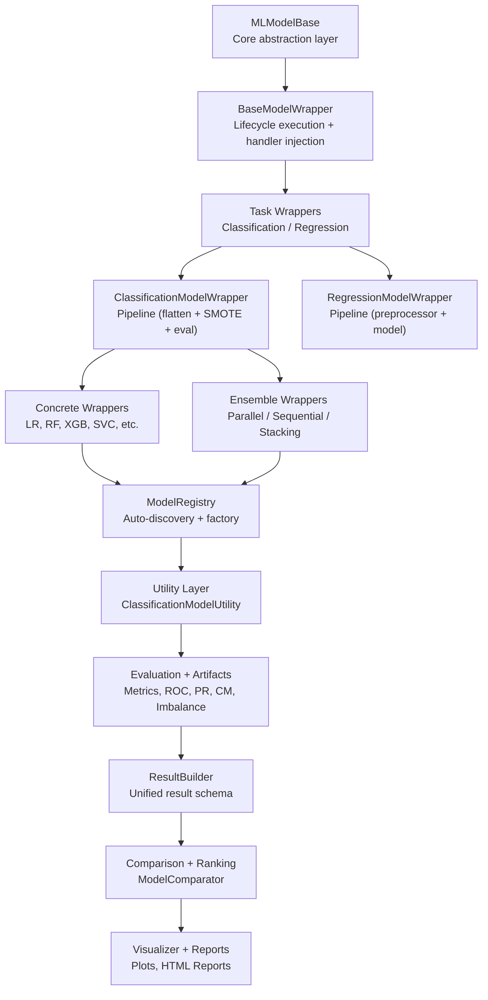
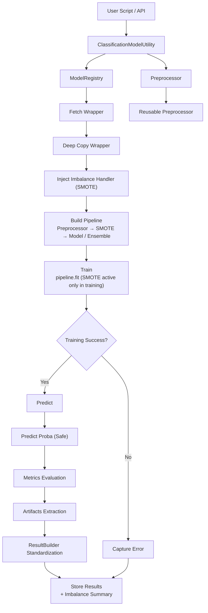
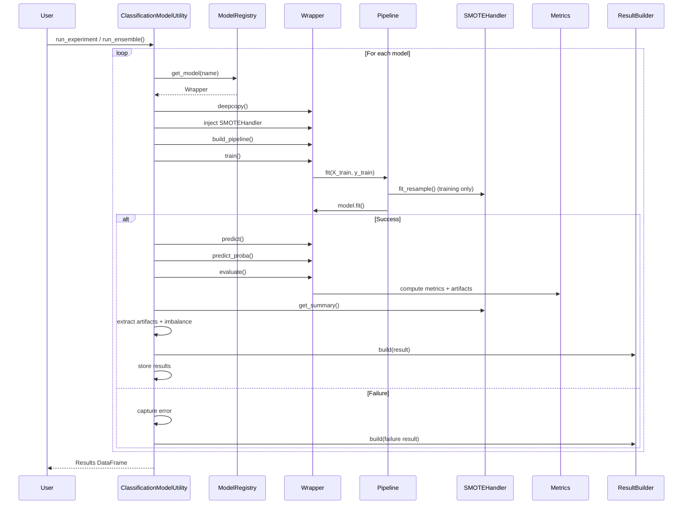
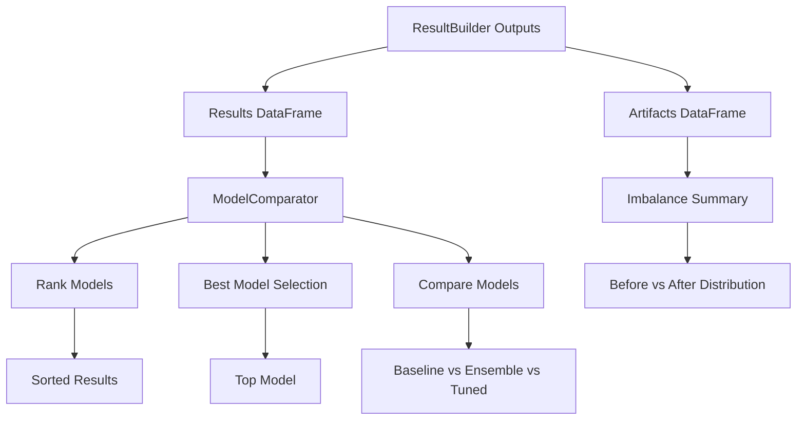
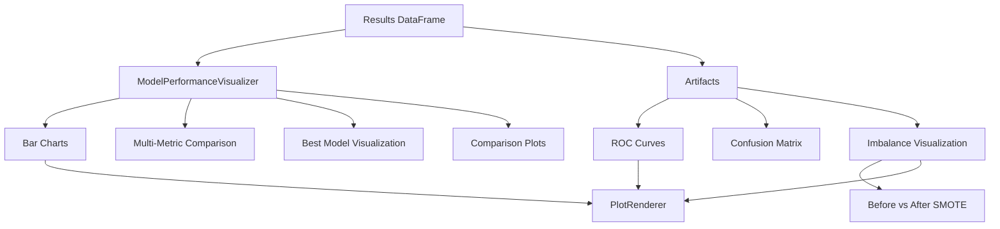
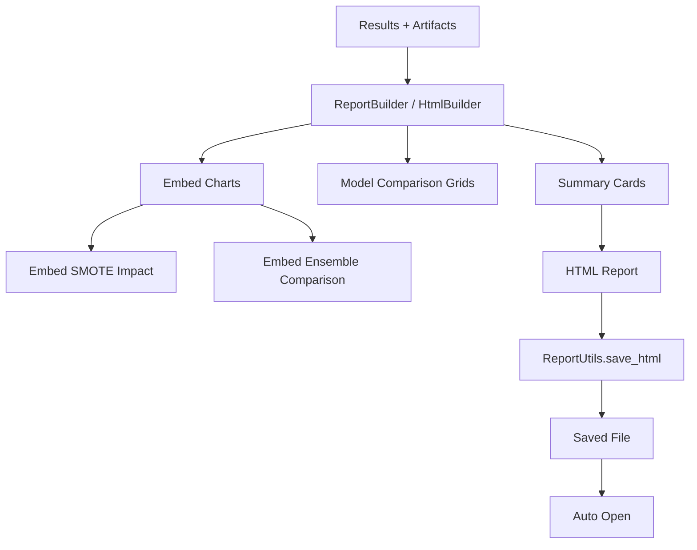

# 🚀 Machine Learning Framework (Modular & Extensible)


---

## 📌 Overview

This repository provides a **modular, scalable, and loosely coupled machine learning framework** designed for:

- Experiment-driven ML workflows
- Rapid prototyping
- Production-grade extensibility

---

## 🧭 Architecture Overview

### ML Framework Layered Architecture



### 🔷 High-Level Flow



---

### 🔁 Sequence Diagram



### RESULTS & COMPARISON FLOW



### VISUALIZATION FLOW



### REPORT GENERATION FLOW



---

## 📂 Folder Structure

```
machinelearning/
│
├── README.md
│   # Architecture overview (Wrapper-driven + Pipeline + Imbalance-aware)
│   # End-to-end flows + diagrams
│   # AutoML-ready design principles
│
├── base/
│   ├── MLModelBase.py
│   │   # Core abstraction (build_pipeline / train / predict contract)
│   │
│   ├── BaseModelWrapper.py
│   │   # Execution engine (pipeline lifecycle + handler injection)
│   │
│   ├── ClassificationModelWrapper.py
│   │   # Pipeline builder (flatten + SMOTE + model)
│   │   # Supports predict_proba + classification evaluation
│   │
│   ├── RegressionModelWrapper.py
│   |       # Simple pipeline (preprocessor + model)
│   |      # Regression-only evaluation
|   ├── EnsembleModelWrapper.py
|   ├── ParallelEnsembleWrapper.py
|   ├── SequentialEnsembleWrapper.py
|   ├── StackingEnsembleWrapper.py
├── evaluation/
│   ├── Metrics.py
│   │   # PURE metrics layer (classification vs regression separation)
│   │   # Returns both numeric metrics + artifacts
│   │
│   ├── METRICS.md
│   │   # Updated (artifact separation + task-aware design)
│   │
│   ├── ModelComparator.py
│   │   # Generic comparison engine
│   │   # Works across experiments
│   │
│   ├── ClassificationModelComparator.py
│       # Ranking + best model selection (classification-specific)
│
├── facade/
│   ├── ClassificationModelUtility.py
│   │   # Core orchestration layer
│   │   # Wrapper-based execution
│   │   # Imbalance-aware (SMOTE / future strategies)
│   │   # Artifact-aware + result normalization
│   │
│   ├── CLASSIFICATIONMODELUTILITY.md
│   │   # FULL lifecycle documentation
│   │   # Pipeline + SMOTE + metrics + tuning + artifacts
│   │
│   ├── RegressionModelUtility.py
│   │   # Regression orchestration
│   │   # Clean separation from classification logic
│   │
│   ├── RegressionModelUtility.md
│       # Regression-specific workflow documentation
│
├── models/
│   ├── __init__.py
│   │   # Entry point for model discovery
│   │
│   ├── classification/
│   │   ├── __init__.py
│   │   │   # Registers all classification wrappers
│   │   │
│   │   ├── LogisticRegressionWrapper.py
│   │   ├── DecisionTreeClassifierWrapper.py
│   │   ├── RandomForestWrapper.py
│   │   ├── KNNClassifierWrapper.py
│   │   ├── SVCWrapper.py
│   │   ├── XGBoostWrapper.py
│   │   │
│   │       # All follow:
│   │       # task="classification"
│   │       # family="linear/tree/boosting"
│   │
│   ├── regression/
│       ├── __init__.py
│       │   # Registers all regression wrappers
│       │
│       ├── LinearRegressionWrapper.py
│       ├── RidgeWrapper.py
│       ├── LassoWrapper.py
│       ├── ElasticNetWrapper.py
│           # task="regression", family="linear"
│
├── pipeline/
│   ├── Preprocessor.py
│   │   # PIPELINE BUILDER (NOT executor)
│   │   # Combines: Imputer → Outlier → Encoder → Transformer
│   │
│   ├── imbalance/
│   │   ├── BaseImbalanceHandler.py
│   │   │   # Abstraction for imbalance strategies
│   │   │
│   │   ├── SMOTEHandler.py
│   │   │   # Oversampling + before/after tracking
│   │   │
│   │   ├── SMOTEENNHandler.py
│   │   │   # Combined over + under sampling (future-ready)
│   │   │
│   │   ├── ImbalanceFactory.py
│   │       # Config-driven strategy resolver (AutoML-ready 🚀)
│   │
│   ├── CustomImputer.py
│   │   # Missing value handler (group-aware + logging)
│   │
│   ├── CustomImputer.md
│   │   # Framework integration + pipeline safety
│   │
│   ├── OutlierHandler.py
│   │   # Outlier transformation (no row deletion)
│   │
│   ├── OutlierHandler.md
│       # Pipeline compatibility + observability
│
├── registry/
│   ├── ModelRegistry.py
│       # Wrapper discovery engine
│       # Task-aware (classification / regression)
│       # Family-aware filtering
│
├── shared/
│   ├── DataCleaner.py
│   │   # Flatten CV outputs + normalize results
│   │
│   ├── Formatter.py
│   │   # Standardized experiment naming
│   │
│   ├── ClassificationFormatter.py
│   |    # Artifact formatting (ROC / PR / CM / SMOTE summary)
│   ├── ResultBuilder.py
|
├── tuning/
│   ├── HyperparameterTuner.py
│   │   # Regression tuner (correct scoring)
│   │
│   ├── HyperparameterTuner.md
│   │   # Regression workflow
│   │
│   ├── ClassificationHyperparameterTuner.py
│       # Classification tuner
│       # Wrapper-based + SMOTE-aware
│
├── visualization/
│   ├── README.md
│   │   # Visualization architecture overview
│   │
│   ├── core/
│   │   ├── MetricResolver.py
│   │       # Dynamically selects best metrics
│   │
│   ├── generic/
│   │   ├── ClassificationPlots.py
│   │   │   # ROC, PR, multi-metric, comparison
│   │   │   # SMOTE impact visualization
│   │   │
│   │   ├── CLASSIFICATIONPLOTS.md
│   │   │
│   │   ├── ModelPerformanceVisualizer.py
│   │   │   # Combines results + artifacts
│   │   │
│   │   ├── ModelPerformanceVisualizer.md
│   │
│   ├── advanced/
│       ├── ComparisonPlots.py
│       ├── HyperparameterPlots.py
│       ├── OptimizationPlots.py
│           # Optimization + trends
│
├── reports/
│   ├── report_utils.py
│       # HTML report generation utilities
│
```

---

## ✅ Core Layers

| Layer         | Responsibility                                                              |
| ------------- | --------------------------------------------------------------------------- |
| Utility       | End-to-end orchestration (execution, ensembles, tuning, result flow)        |
| Registry      | Centralized model / wrapper discovery and dynamic resolution                |
| Wrapper       | Pipeline construction + execution (Preprocessor → SMOTE → Model / Ensemble) |
| Pipeline      | Feature engineering (Imputer, Encoder, Transformer, Outlier handling)       |
| Imbalance     | Handling class imbalance (SMOTE, SMOTEENN, future strategies)               |
| Metrics       | Evaluation + artifact generation (ROC, PR, CM, reports)                     |
| ResultBuilder | Standardized result construction (metrics + artifacts + metadata)           |
| Comparator    | Model ranking, comparison, and best model selection                         |
| Tuner         | Hyperparameter optimization (grid, random, CV-based tuning)                 |
| Visualization | Plotting and insights (metrics comparison, ROC, imbalance impact)           |
| Reporting     | HTML report generation and result presentation                              |

---

## 🚀 End-to-End Flow

```python
# ✅ Initialize utility
cm = ClassificationModelUtility(
    df,
    target_col,
 (split + preprocessing pipeline)    imbalance_config=imbalance_config
cm.prepare_data()

# ✅ Run baseline models
cm.run_all_models()

# ✅ Run ensemble models ✅
cm.run_ensemble({
    "type": "parallel",
    "method": "voting",
    "model_names": ["LogisticRegression", "RandomForestClassifier", "XGBoost"]
})

# ✅ Hyperparameter tuning
cm.tune_model("RandomForestClassifier", param_config)

# ✅ Get standardized results (ResultBuilder ✅)
results = cm.get_results_df()
)

```

---

## Unified Execution Flow

```
prepare_data()
↓
Preprocessor (Reusable)
↓
run_all_models / run_ensemble / tune_model
↓
Wrapper → Pipeline
↓
SMOTE (training only)
↓
Model / Ensemble
↓
Metrics + Artifacts
↓
ResultBuilder
↓
Results DataFrame

```

## Classification Flow

```

ClassificationModelUtility
↓
Wrapper-based Pipeline
↓
SMOTE (if configured)
↓
Model / Ensemble (Voting / Boosting / Stacking)
↓
Metrics.classification
↓
ROC / PR / Confusion Matrix
↓
Artifacts + Imbalance Summary
↓
ResultBuilder

```

## Regression Flow

```

RegressionModelUtility
↓
Wrapper-based Pipeline
↓
(No SMOTE)
↓
Regression Models
↓
Metrics.regression
↓
R² / MSE / RMSE
↓
Artifacts (if applicable)
↓
ResultBuilder

```

---

## ✅ Design Principles

- ✅ Separation of concerns
  → Clear boundaries between layers:
  `Utility → Wrapper → Pipeline → Evaluation → Results → Visualization`
- ✅ Loose coupling
  → Components interact via well-defined contracts (wrappers, registry, ResultBuilder), enabling independent evolution
- ✅ Extensibility
  → Plug-and-play support for:

        Ensemble strategies (Parallel, Sequential, Stacking)
        Imbalance techniques (SMOTE, SMOTEENN, etc.)
        Custom pipelines and transformers

- ✅ Pipeline-First Architecture
  → All execution follows a consistent, reusable flow:

         Preprocessor → Imbalance Handler → Model / Ensemble

- ✅ Unified Result Standardization
  → ResultBuilder ensures consistent schema across:

        Baseline
        Ensemble
        Tuned models

- ✅ Config-Driven Flexibility
  → Behavior controlled via configuration (models, ensembles, imbalance, tuning)
- ✅ Task-Aware Design
  → Built-in tracking of:

        Metrics (accuracy, F1, etc.)
        Artifacts (ROC, PR, Confusion Matrix)
        Imbalance effects (before vs after SMOTE)

- ✅ Production-ready

---

## ✅ Future Scope

- AutoML orchestrator
- Multi-metric tuning
- Explainability integration

---

## ✅ Summary

This framework is now:

- 🚀 Production-ready
- 🚀 AutoML-compatible
- 🚀 Fully modular
- 🚀 Architecturally clean

```

```
