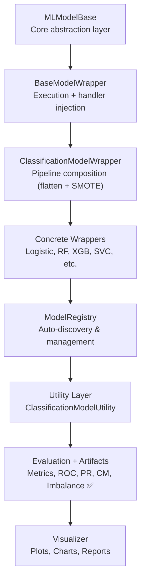
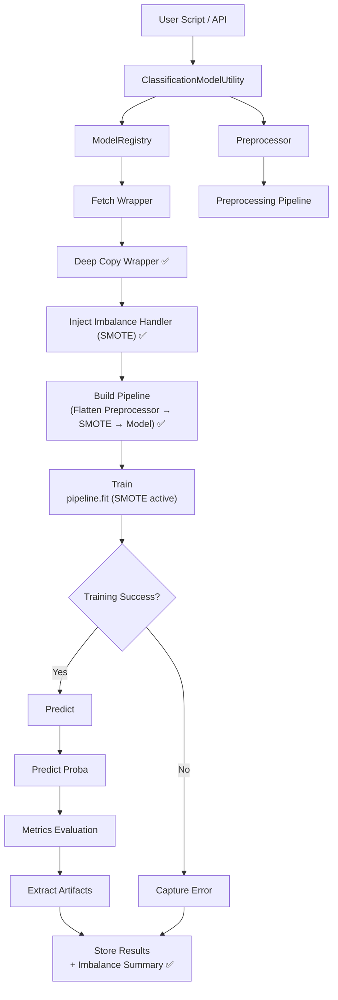
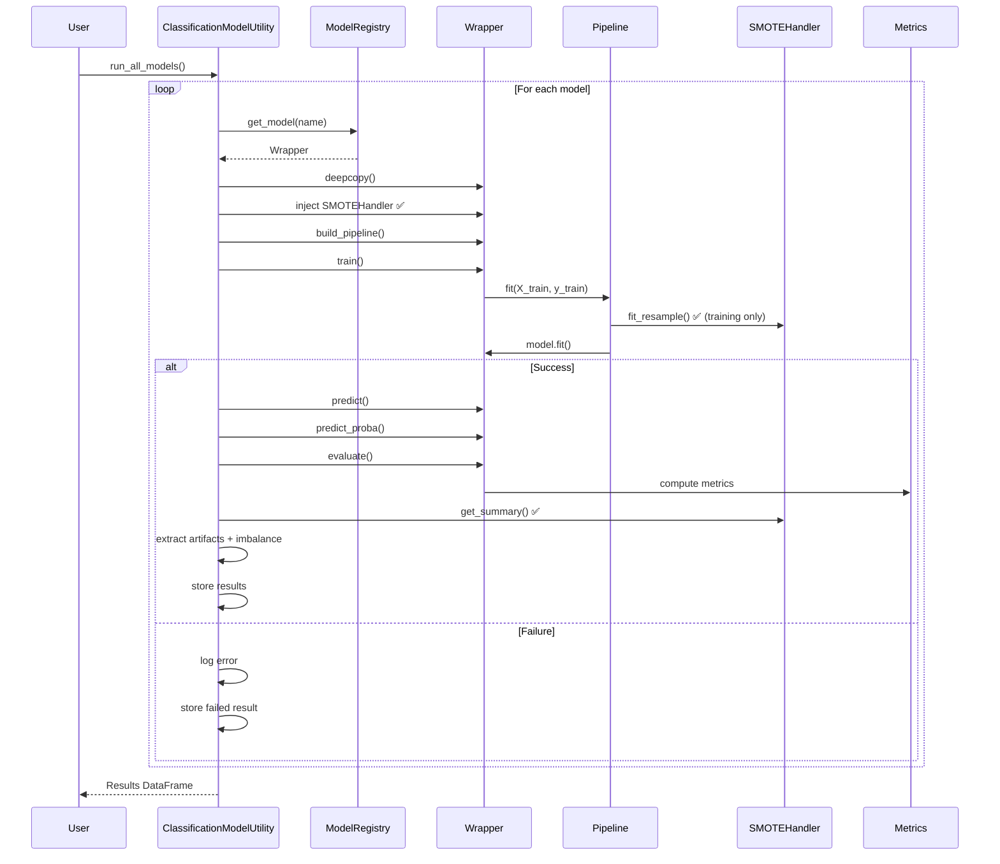
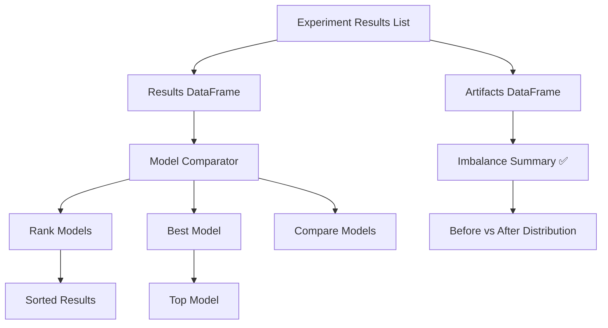
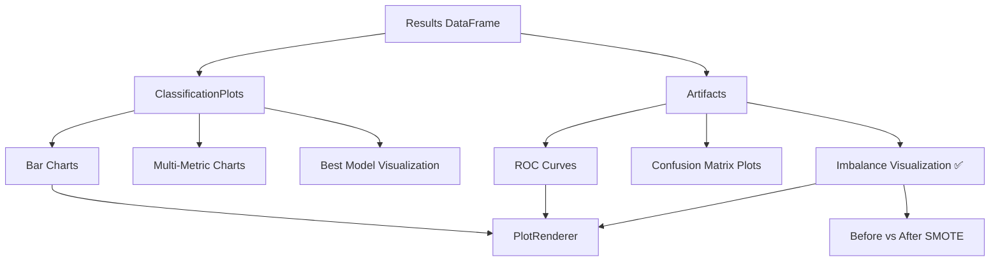
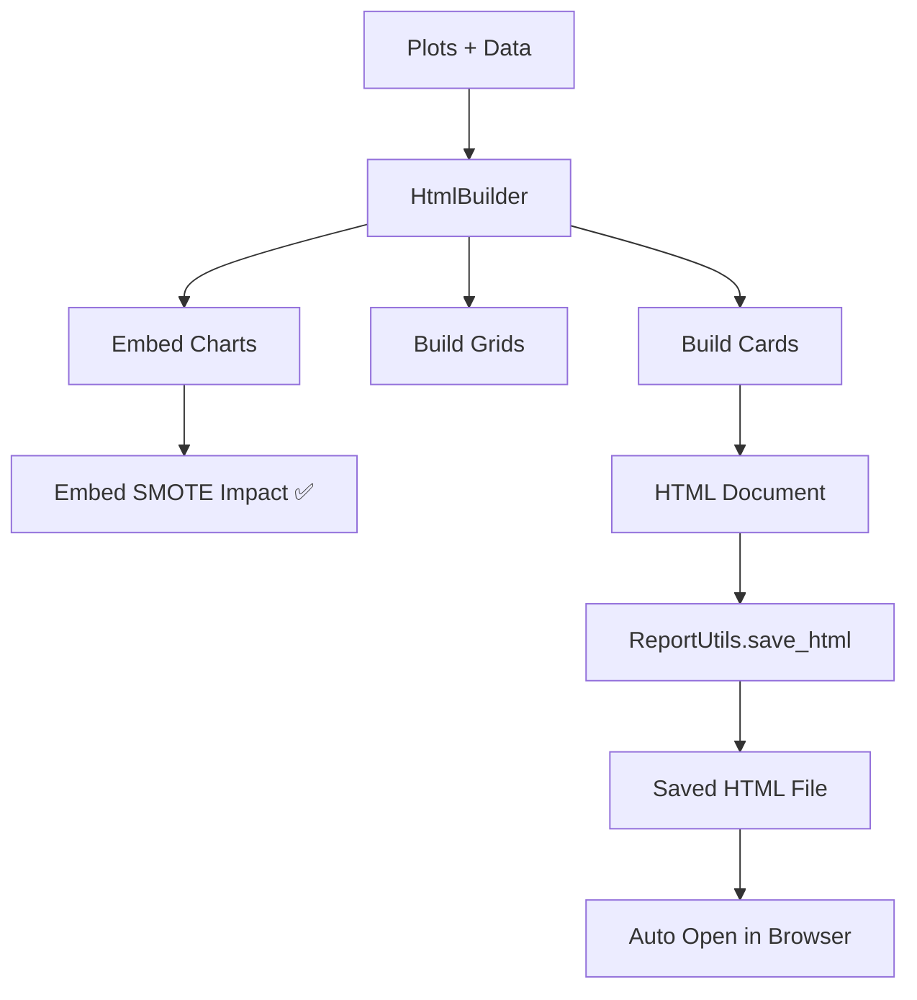

# 🚀 Machine Learning Framework (Modular & Extensible)


---

## 📌 Overview

This repository provides a **modular, scalable, and loosely coupled machine learning framework** designed for:

- Experiment-driven ML workflows
- Rapid prototyping
- Production-grade extensibility

---

## 🧭 Architecture Overview

### ML Framework Layered Architecture



### 🔷 High-Level Flow



---

### 🔁 Sequence Diagram



### RESULTS & COMPARISON FLOW



### VISUALIZATION FLOW



### REPORT GENERATION FLOW



---

## 📂 Folder Structure

```
machinelearning/
│
├── README.md
│   # ✅ Architecture overview (Wrapper-driven + Pipeline + Imbalance-aware)
│   # ✅ End-to-end flows + diagrams
│   # ✅ AutoML-ready design principles
│
├── base/
│   ├── MLModelBase.py
│   │   # ✅ Core abstraction (build_pipeline / train / predict contract)
│   │
│   ├── BaseModelWrapper.py
│   │   # ✅ Execution engine (pipeline lifecycle + handler injection)
│   │
│   ├── ClassificationModelWrapper.py
│   │   # ✅ Pipeline builder (flatten + SMOTE + model)
│   │   # ✅ Supports predict_proba + classification evaluation
│   │
│   ├── RegressionModelWrapper.py
│       # ✅ Simple pipeline (preprocessor + model)
│       # ✅ Regression-only evaluation
│
├── evaluation/
│   ├── Metrics.py
│   │   # ✅ PURE metrics layer (classification vs regression separation)
│   │   # ✅ Returns both numeric metrics + artifacts
│   │
│   ├── METRICS.md
│   │   # ✅ Updated (artifact separation + task-aware design)
│   │
│   ├── ModelComparator.py
│   │   # ✅ Generic comparison engine
│   │   # ✅ Works across experiments
│   │
│   ├── ClassificationModelComparator.py
│       # ✅ Ranking + best model selection (classification-specific)
│
├── facade/
│   ├── ClassificationModelUtility.py
│   │   # ✅ Core orchestration layer
│   │   # ✅ Wrapper-based execution
│   │   # ✅ Imbalance-aware (SMOTE / future strategies)
│   │   # ✅ Artifact-aware + result normalization
│   │
│   ├── CLASSIFICATIONMODELUTILITY.md
│   │   # ✅ FULL lifecycle documentation
│   │   # ✅ Pipeline + SMOTE + metrics + tuning + artifacts
│   │
│   ├── RegressionModelUtility.py
│   │   # ✅ Regression orchestration
│   │   # ✅ Clean separation from classification logic
│   │
│   ├── RegressionModelUtility.md
│       # ✅ Regression-specific workflow documentation
│
├── models/
│   ├── __init__.py
│   │   # ✅ Entry point for model discovery
│   │
│   ├── classification/
│   │   ├── __init__.py
│   │   │   # ✅ Registers all classification wrappers
│   │   │
│   │   ├── LogisticRegressionWrapper.py
│   │   ├── DecisionTreeClassifierWrapper.py
│   │   ├── RandomForestWrapper.py
│   │   ├── KNNClassifierWrapper.py
│   │   ├── SVCWrapper.py
│   │   ├── XGBoostWrapper.py
│   │   │
│   │       # ✅ All follow:
│   │       # task="classification"
│   │       # family="linear/tree/boosting"
│   │
│   ├── regression/
│       ├── __init__.py
│       │   # ✅ Registers all regression wrappers
│       │
│       ├── LinearRegressionWrapper.py
│       ├── RidgeWrapper.py
│       ├── LassoWrapper.py
│       ├── ElasticNetWrapper.py
│           # ✅ task="regression", family="linear"
│
├── pipeline/
│   ├── Preprocessor.py
│   │   # ✅ PIPELINE BUILDER (NOT executor)
│   │   # ✅ Combines: Imputer → Outlier → Encoder → Transformer
│   │
│   ├── imbalance/
│   │   ├── BaseImbalanceHandler.py
│   │   │   # ✅ Abstraction for imbalance strategies
│   │   │
│   │   ├── SMOTEHandler.py
│   │   │   # ✅ Oversampling + before/after tracking ✅
│   │   │
│   │   ├── SMOTEENNHandler.py
│   │   │   # ✅ Combined over + under sampling (future-ready)
│   │   │
│   │   ├── ImbalanceFactory.py
│   │       # ✅ Config-driven strategy resolver (AutoML-ready 🚀)
│   │
│   ├── CustomImputer.py
│   │   # ✅ Missing value handler (group-aware + logging)
│   │
│   ├── CustomImputer.md
│   │   # ✅ Framework integration + pipeline safety
│   │
│   ├── OutlierHandler.py
│   │   # ✅ Outlier transformation (no row deletion)
│   │
│   ├── OutlierHandler.md
│       # ✅ Pipeline compatibility + observability
│
├── registry/
│   ├── ModelRegistry.py
│       # ✅ Wrapper discovery engine
│       # ✅ Task-aware (classification / regression)
│       # ✅ Family-aware filtering
│
├── shared/
│   ├── DataCleaner.py
│   │   # ✅ Flatten CV outputs + normalize results
│   │
│   ├── Formatter.py
│   │   # ✅ Standardized experiment naming
│   │
│   ├── ClassificationFormatter.py
│       # ✅ Artifact formatting (ROC / PR / CM / SMOTE summary ✅)
│
├── tuning/
│   ├── HyperparameterTuner.py
│   │   # ✅ Regression tuner (correct scoring)
│   │
│   ├── HyperparameterTuner.md
│   │   # ✅ Regression workflow
│   │
│   ├── ClassificationHyperparameterTuner.py
│       # ✅ Classification tuner
│       # ✅ Wrapper-based + SMOTE-aware ✅
│
├── visualization/
│   ├── README.md
│   │   # ✅ Visualization architecture overview
│   │
│   ├── core/
│   │   ├── MetricResolver.py
│   │       # ✅ Dynamically selects best metrics
│   │
│   ├── generic/
│   │   ├── ClassificationPlots.py
│   │   │   # ✅ ROC, PR, multi-metric, comparison
│   │   │   # ✅ SMOTE impact visualization ✅
│   │   │
│   │   ├── CLASSIFICATIONPLOTS.md
│   │   │
│   │   ├── ModelPerformanceVisualizer.py
│   │   │   # ✅ Combines results + artifacts
│   │   │
│   │   ├── ModelPerformanceVisualizer.md
│   │
│   ├── advanced/
│       ├── ComparisonPlots.py
│       ├── HyperparameterPlots.py
│       ├── OptimizationPlots.py
│           # ✅ Optimization + trends
│
├── reports/
│   ├── report_utils.py
│       # ✅ HTML report generation utilities
│
```

---

## ✅ Core Layers

| Layer        | Responsibility         |
| ------------ | ---------------------- |
| Utility      | Orchestration          |
| Registry     | Model discovery        |
| Wrapper      | Pipeline + model       |
| Preprocessor | Feature transformation |
| Metrics      | Evaluation             |
| Tuner        | Optimization           |

---

## ✅ Key Improvements

- ✅ Wrapper-driven architecture
- ✅ Regression vs classification separation
- ✅ Fixed scoring bug in tuning
- ✅ Artifact-aware design
- ✅ Experiment-level tracking

---

## 🚀 End-to-End Flow

```python
lm = LinearModelUtility(df, "target")
lm.prepare_data()
lm.run_all_models()
lm.tune_model("Ridge", param_grid)
results = lm.get_results_df()
```

---

## ✅ Classification Flow

```
ClassificationModelUtility → Metrics.classification → ROC / CM
```

## ✅ Regression Flow

```
LinearModelUtility → Metrics.regression → R2 / MSE
```

---

## ✅ Key Fixes Implemented

- ❌ Removed misuse of classification scoring in regression
- ✅ Enforced proper scoring in tuner
- ✅ Fixed empty tuning results issue

---

## ✅ Design Principles

- ✅ Separation of concerns
- ✅ Loose coupling
- ✅ Extensibility
- ✅ Production-ready

---

## ✅ Future Scope

- AutoML orchestrator
- Multi-metric tuning
- Explainability integration

---

## ✅ Summary

This framework is now:

🚀 Production-ready
🚀 AutoML-compatible
🚀 Fully modular
🚀 Architecturally clean
