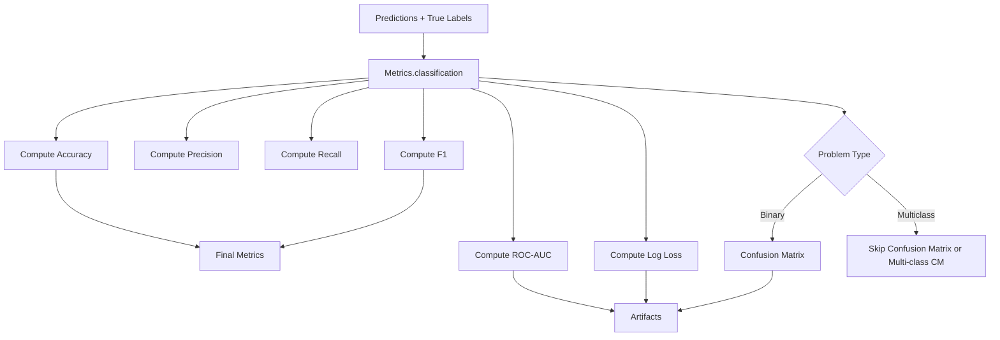

# Metrics Utility Documentation

## Overview

The `Metrics` class provides a centralized computation layer for regression and classification tasks.
It focuses purely on metric calculation and avoids UI or formatting concerns.

---

## Design Principles

- ✅ Pure computation (stateless)
- ✅ Supports binary, multiclass, multilabel
- ✅ Separation of concerns (no formatting)
- ✅ Extensible for future metrics

---

## EVALUATION & METRICS FLOW



## Regression Metrics

```python
Metrics.regression(y_true, y_pred)
```

### Returns

- R2
- MSE
- RMSE

---

## Classification Metrics

```python
Metrics.classification(
    y_true,
    y_pred,
    y_proba=None,
    average="weighted",
    include_curves=False,
    include_report=False,
    include_confusion_matrix=False
)
```

---

## Core Features

### 1. Automatic Problem Type Detection

Uses:

```python
type_of_target(y_true)
```

Supports:

- binary
- multiclass
- multilabel-indicator

---

### 2. Basic Metrics

- Accuracy
- Precision
- Recall
- F1-score

Averaging strategy:

| Problem Type | Average      |
| ------------ | ------------ |
| Binary       | weighted     |
| Multiclass   | configurable |
| Multilabel   | samples      |

---

### 3. ROC-AUC

- Binary → standard ROC
- Multiclass → OvR
- Multilabel → sample average

---

### 4. Log Loss

Computed only if probabilities are available.

---

### 5. Confusion Matrix

- Included only if enabled
- Raw output (no formatting)

---

### 6. Classification Report

- Optional
- Returned as dictionary

---

### 7. Curve Generation

#### Binary

- ROC curve
- PR curve
- Thresholds included

#### Multiclass

- One-vs-Rest curves per class

#### Multilabel

- ROC per label
- Skips invalid labels

---

## Output Structure

```python
{
    "accuracy": float,
    "precision": float,
    "recall": float,
    "f1": float,
    "roc_auc": float,
    "log_loss": float,
    "problem_type": str,

    # Optional artifacts
    "confusion_matrix": np.ndarray,
    "classification_report": dict,
    "roc_curve": dict,
    "pr_curve": dict
}
```

---

## Best Practices

- Keep Metrics pure (no formatting logic)
- Use formatter layer for UI rendering
- Validate multilabel distributions
- Avoid using confusion matrix for multilabel directly

---

## Integration Pattern

```python
metrics = Metrics.classification(...)
artifacts = extract_artifacts(metrics)
formatted = ClassificationFormatter.format(...)
```

---

## ✅ Key Updates (Recent Changes)

### 1. Strict Separation of Concerns

- ✅ Classification metrics and regression metrics are now **fully separated**
- ✅ Hyperparameter tuning uses **task-specific scoring only**
- ✅ Removed fallback to incorrect metrics (e.g., accuracy for regression)

---

## Future Extensions

- PR AUC
- Calibration metrics
- Gain/Lift curves
- Threshold optimization

---

## Summary

The Metrics class forms the backbone of the ML evaluation layer. Combined with a Formatter, it enables building scalable, production-grade ML pipelines.
