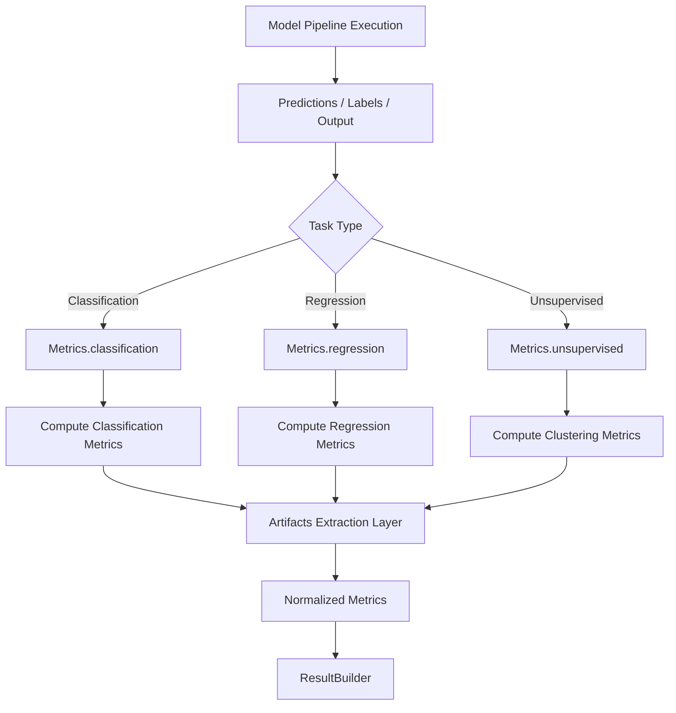
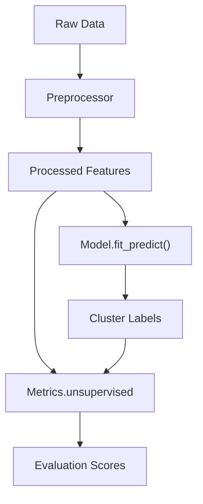

# Metrics Utility Documentation

## Overview

The Metrics class is a centralized evaluation engine responsible for computing metrics across:

- ✅ Classification
- ✅ Regression
- ✅ Unsupervised Learning (NEW)

It strictly focuses on metric computation only, without any UI, formatting, or reporting logic.

---

## Design Principles

- ✅ Pure computation (stateless)
- ✅ Task-specific evaluation (no mixing of metrics)
- ✅ Supports supervised + unsupervised workflows
- ✅ Separation of concerns (no formatting/UI)
- ✅ Compatible with ResultBuilder + Utility layers
- ✅ Extensible for future metrics

---

## EVALUATION & METRICS FLOW



## SUPERVISED METRICS

### Classification Metrics

```Python
Metrics.classification(
    y_true,
    y_pred,
    y_proba=None,
    average="weighted",
    include_curves=False,
    include_report=False,
    include_confusion_matrix=False
)
```

### Core Metrics

- Accuracy
- Precision
- Recall
- F1 Score

### Advanced Metrics

- ROC-AUC
- Log Loss
  - Computed only if probabilities are available.
- PR Curve
- ROC Curve
- Classification Report
- Confusion Matrix
  - Included only if enabled
  - Raw output (no formatting)

### Problem Type Handling

| Type       | Handling         |
| ---------- | ---------------- |
| Binary     | Standard         |
| Multiclass | OvR              |
| Multilabel | Sample averaging |

### Output Structure

```Python
{
    "accuracy": float,
    "precision": float,
    "recall": float,
    "f1": float,
    "roc_auc": float,
    "log_loss": float,
    "problem_type": str,

    # Optional artifacts
    "confusion_matrix": np.ndarray,
    "classification_report": dict,
    "roc_curve": dict,
    "pr_curve": dict
}
```

## REGRESSION METRICS

### Usage

```Python
Metrics.regression(y_true, y_pred)
```

### Returns

- R2 Score
- Mean Squared Error (MSE)
- Root Mean Squared Error (RMSE)

## UNSUPERVISED METRICS (NEW)

### Usage

```Python
Metrics.unsupervised(X_processed, labels)
```

### IMPORTANT

👉 Always use processed (scaled + encoded) data

```Python
X_processed = preprocessor.transform(X)
```

### Metrics Computed

| Metric                  | Purpose                               |
| ----------------------- | ------------------------------------- |
| Silhouette Score        | Cluster separation                    |
| Davies-Bouldin Index    | Cluster compactness (lower is better) |
| Calinski-Harabasz Score | Cluster density                       |

## Flow



### Output

```Python
{
    "silhouette_score": float,
    "davies_bouldin": float,
    "calinski_harabasz": float
}

```

## ARTIFACT SEPARATION (FRAMEWORK PATTERN)

### Why Separation?

| Type             | Location        |
| ---------------- | --------------- |
| Metrics (scalar) | ResultBuilder   |
| Heavy objects    | Artifacts layer |

### Example

```Python
metrics = wrapper.evaluate(...)
artifacts, metrics = extract_artifacts(metrics)

```

## INTEGRATION PATTERN

### Classification

```Python
metrics = Metrics.classification(...)
artifacts, metrics = extract_artifacts(metrics)
result = ResultBuilder.build(..., \*\*metrics)
```

### Unsupervised

```Python
raw_metrics = wrapper.evaluate(X_processed, labels)
metrics = \_normalize_metrics(raw_metrics)
result = ResultBuilder.build(..., \*\*metrics)
```

## DESIGN HIGHLIGHTS

- Clean Separation
  - Metrics → Computation
  - Formatter → Presentation
  - ResultBuilder → Structuring

## Pipeline-Aware Evaluation

- Uses transformed data
- Avoids raw data leakage
- Ensures correct distance-based computation

## Consistent Across Framework

| Layer         | Role          |
| ------------- | ------------- |
| Utility       | Orchestration |
| Wrapper       | Execution     |
| Metrics       | Evaluation    |
| ResultBuilder | Output        |

## BEST PRACTICES

- ✅ Always evaluate using processed data
- ✅ Keep Metrics stateless
- ✅ Avoid mixing tasks (classification vs regression vs clustering)
- ✅ Extract heavy artifacts outside metrics
- ✅ Normalize metrics before building final result

---

## Future Extensions

- PR AUC
- Calibration metrics
- Gain/Lift curves
- Threshold optimization
- Silhouette per sample
- Cluster stability metrics

---

## Summary

The Metrics utility is the core evaluation engine of your ML framework, enabling:

- ✅ Accurate and consistent model evaluation
- ✅ Support for supervised and unsupervised workflows
- ✅ Clean separation of computation and presentation
- ✅ Seamless integration with pipelines and ResultBuilder

  It ensures that every model is evaluated correctly, consistently, and at production scale.
