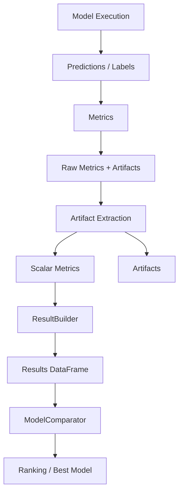

# Evaluation Layer Documentation

## ✅ Overview

The **evaluation module** is responsible for model evaluation, comparison, and ranking across all machine learning paradigms:

- ✅ Classification
- ✅ Regression
- ✅ Unsupervised (Clustering)

It provides a **clean separation between metric computation, model ranking, and result interpretation**.

---

## ✅ Architecture

```
evaluation/
├── Metrics.py
├── METRICS.md
├── BaseComparator.py
├── ClassificationModelComparator.py
├── RegressionModelComparator.py
├── UnsupervisedModelComparator.py
├── ModelComparator.py
├── MetricResolver.py
```

---

## ✅ Core Responsibilities

| Component        | Responsibility                |
| ---------------- | ----------------------------- |
| Metrics          | Compute evaluation metrics    |
| BaseComparator   | Generic ranking engine        |
| ModelComparator  | Task-based comparator factory |
| Task Comparators | Task-specific ranking logic   |
| MetricResolver   | Default metric selection      |

---

## ✅ Evaluation Flow



---

## ✅ Metrics Layer

### Supported Tasks

- Classification
- Regression
- Unsupervised

### Key Features

- Multi-metric support (f1 variants, roc_auc, rmse, silhouette)
- Artifact separation (ROC, PR, confusion matrix)
- Task-aware output structure

---

## ✅ Comparator Layer

### BaseComparator

Provides:

- ✅ Ranking (auto direction)
- ✅ Best model
- ✅ Per-model selection

### Task-Specific Comparators

| Comparator     | Default Metric   |
| -------------- | ---------------- |
| Classification | f1_weighted      |
| Regression     | R2               |
| Unsupervised   | silhouette_score |

---

## ✅ ModelComparator (Factory)

Automatically selects comparator based on task:

```python
comp = ModelComparator.get_comparator(results)
```

---

## ✅ MetricResolver

Provides:

- ✅ Default metric per task
- ✅ Metric direction rules

Example:

```python
metric = MetricResolver.get_best_metric("classification")
```

---

## ✅ Metric Directions

| Metric           | Direction |
| ---------------- | --------- |
| accuracy         | ↑         |
| f1_weighted      | ↑         |
| roc_auc          | ↑         |
| pr_auc           | ↑         |
| R2               | ↑         |
| RMSE             | ↓         |
| MSE              | ↓         |
| silhouette_score | ↑         |
| davies_bouldin   | ↓         |

---

## ✅ Usage Examples

### Rank Models

```python
comp = ModelComparator.get_comparator(results)
comp.rank()
```

### Best Model

```python
comp.best_model()
```

### Custom Metric

```python
comp.rank(metric="roc_auc")
```

---

## ✅ Best Practices

- Always use task-aware comparators
- Keep metrics computation separate from ranking
- Normalize numpy values before storing
- Use MetricResolver for default metric selection
- Avoid mixing artifacts with scalar metrics

---

## ✅ Summary

The evaluation layer provides:

- ✅ Unified evaluation across ML types
- ✅ Clean architecture separation
- ✅ Flexible metric selection
- ✅ Extensible comparator design
- ✅ AutoML-ready evaluation pipeline
