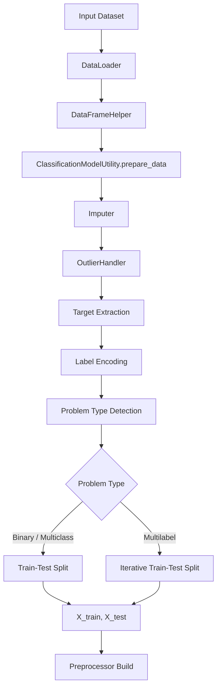
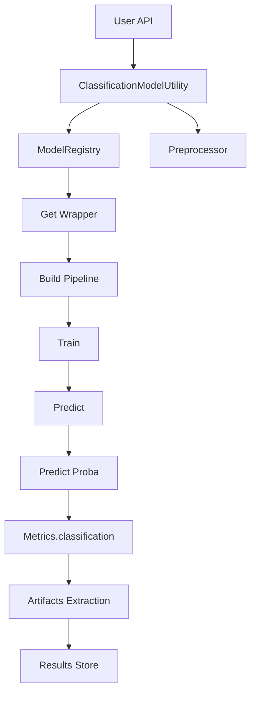
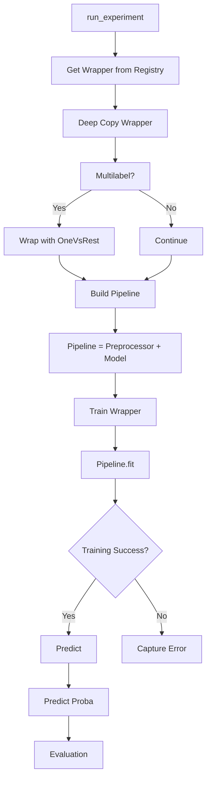
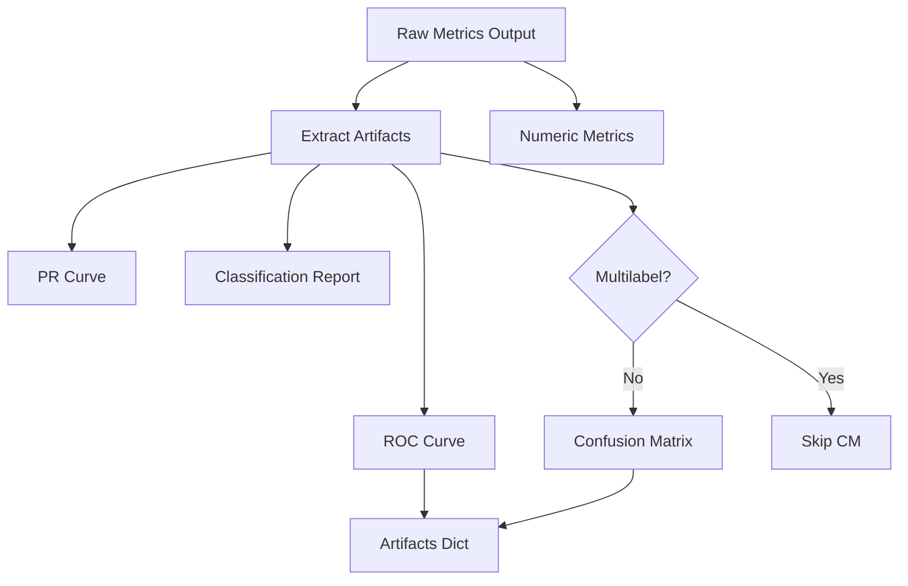

# ClassificationModelUtility – Detailed Documentation

## Overview

The `ClassificationModelUtility` is a high-level orchestration layer designed to manage end-to-end classification workflows. It integrates preprocessing, model execution, evaluation, tuning, and result management into a unified, extensible framework.

---

## Architecture

### DATA PREPARATION FLOW





### TRAINING & INFERENCE FLOW



### ARTIFACT EXTRACTION FLOW



---

## ✅ Key Responsibilities (Refactored)

- Data preparation and splitting
- Model execution via Wrapper architecture
- Metric computation using Metrics (classification only)
- Artifact extraction (ROC, PR, CM)
- Hyperparameter tuning (via ClassificationHyperparameterTuner)
- Result aggregation, normalization, and ranking
- Failure-safe model execution

---

## 🚀 Initialization

```python
cm = ClassificationModelUtility(df, target_col, imputer, outlier_handler)
```

### Parameters

- **df**: Input dataset
- **target_col**: Target column or list (multilabel supported)
- **imputer**: Optional CustomImputer
- **outlier_handler**: Optional OutlierHandler

---

## 📊 Data Preparation

```python
cm.prepare_data()
```

### Features

- Auto-detects problem type
- Supports multilabel via iterative train-test split
- Applies preprocessing pipeline (imputer + outlier + encoder)
- Ensures pipeline-safe transformations

---

### Supported Problem Types

| Type       | Strategy         |
| ---------- | ---------------- |
| Binary     | Train/Test Split |
| Multiclass | Train/Test Split |
| Multilabel | Iterative Split  |

---

## ⚙️ Running Experiments

```python
cm.run_experiment("LogisticRegression")
```

### Execution Flow

1. Retrieve model wrapper from registry
2. Deep copy wrapper (avoid state leakage)
3. Wrap with OneVsRest (for multilabel)
4. Build pipeline (Preprocessor + Model)
5. Train pipeline (`fit`)
6. Predict labels
7. Predict probabilities (safe handling)
8. Compute metrics via Metrics.classification
9. Extract artifacts
10. Store structured results

---

## 🔁 Run All Models

```python
cm.run_all_models()
```

### Output

- Returns structured DataFrame
- Skips failed models safely

---

## 📦 Artifact Handling (Refactored)

Artifacts include:

- ROC Curve
- PR Curve
- Confusion Matrix (only for non-multilabel)
- Classification Report

### Separation Logic

```python
artifacts, metrics = _extract_artifacts(metrics)
```

✔ Keeps metrics clean
✔ Avoids UI pollution

---

## 🎯 Probability Handling

Multilabel probabilities are normalized:

```python
np.column_stack([p[:, 1] for p in raw_proba])
```

---

## 🔧 Hyperparameter Tuning (Updated)

```python
cm.tune_model("RandomForest", param_grid)
```

### Supports

- Grid Search ✅
- Random Search ✅

### Key Fix

✔ Strict classification scoring

```
scoring = "accuracy" or "f1_weighted"
```

---

## 📊 Results & Reporting

### Get Results DataFrame

```python
cm.get_results_df()
```

### Get Artifacts

```python
cm.get_artifacts_df()
```

---

## 🧠 Model Comparison

### Rank Models

```python
cm.rank_models(metric="f1")
```

### Best Model

```python
cm.get_best_model(metric="roc_auc")
```

---

## 📉 Confusion Matrix Handling

```python
cm.get_confusion_matrix_df(model_name)
```

✔ Uses ClassificationFormatter
✔ Avoids multilabel misuse

---

## ⚙️ Internal Helpers

### \_get_probabilities

Handles:

- Binary models
- Multiclass
- Multilabel

---

### \_extract_artifacts

Splits metrics vs artifacts

---

## ✅ Design Principles (Updated)

- ✅ Wrapper-based architecture
- ✅ Strict task separation (classification vs regression)
- ✅ Pipeline consistency
- ✅ Artifact-aware design
- ✅ Fault-tolerant execution
- ✅ AutoML-ready structure

---

## ✅ Best Practices

- Avoid confusion matrix for multilabel
- Always validate label distribution
- Use formatter layer for visualization
- Keep metrics computation pure
- Always use wrapper.evaluate()

---

## 🚀 Extensibility

Future Enhancements:

- AutoML orchestration layer
- Model explainability (SHAP)
- Threshold optimization
- Ensemble models (stacking/voting)

---

## ✅ Final Summary

`ClassificationModelUtility` now acts as:

🚀 A fully modular, wrapper-driven ML orchestration engine

Supporting:

- ✅ Multi-model execution
- ✅ Multiclass & multilabel
- ✅ Hyperparameter tuning
- ✅ Artifact-driven evaluation
- ✅ Production-grade ML pipelines
