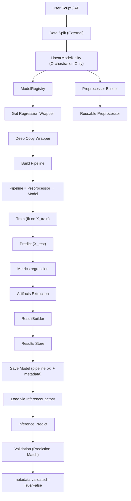

# LinearModelUtility Documentation (Updated)

---

## ✅ Overview

`LinearModelUtility` is the **regression (linear model) orchestration layer** built on a **wrapper-driven architecture**.

It acts as a **facade** coordinating:

- ✅ Data preparation
- ✅ Model execution via Wrapper
- ✅ Regression metric computation
- ✅ Hyperparameter tuning (regression only)
- ✅ Artifact-aware results
- ✅ Experiment tracking
- ✅ Model comparison

---

## 🧱 Updated Architecture Flow



---

## ✅ Key Responsibilities (Refactored)

- ✅ Consumes pre-split data (X_train, y_train, X_test, y_test) — splitting handled externally
- ✅ Builds pipeline-driven preprocessing via Preprocessor (no raw data mutation)
- ✅ Executes models via wrapper abstraction + sklearn pipeline
- ✅ Supports baseline, tuned, and ensemble experiments
- ✅ Computes regression metrics using Metrics.regression
- ✅ Performs hyperparameter tuning (grid/random) with regression scoring
- ✅ Handles artifact extraction (extensible for residuals, plots, etc.)
- ✅ Stores experiment results + trained models
- ✅ Persists models as pipeline.pkl + metadata.json
- ✅ Validates inference pipeline (prediction consistency check)
- ✅ Maintains metadata-driven deployment readiness

---

## 🚀 Constructor

```python
lm = LinearModelUtility(
    X_train=X_train,
    y_train=y_train,
    X_test=X_test,
    y_test=y_test,
    imputer=imputer,
    outlier_handler=outlier
)

```

---

## 📊 Data Preparation

```python
lm.prepare_data()
```

✅ What it does now

- ✅ Validates input (X_train, y_train)
- ✅ Ensures DataFrame-only flow (prevents feature mismatch issues)
- ✅ Builds reusable preprocessing pipeline

`Plain TextPreprocessor = Imputer → Encoder →Show more lines`

✅ Stores:

- self.preprocessor (used in wrapper pipeline)
- feature_names (for inference consistency)

### Features

- Applies preprocessing pipeline (imputer + outlier handler)
- Builds consistent dataset splits
- Ensures pipeline compatibility

---

## ⚙️ Model Execution

### ✅ run_experiment()

```python
lm.run_experiment("Ridge")
```

### Execution Flow

1. Get wrapper from ModelRegistry
2. Deep copy wrapper
3. Build pipeline (Preprocessor + Model)
4. Train (`fit`)
5. Predict (`predict`)
6. Evaluate using `Metrics.regression`
7. Extract artifacts (future-ready)
8. Store structured result

---

## 🔁 Batch Execution

### ✅ run_all_models()

```python
lm.run_all_models()
```

### ✅ run_experiments()

```python
configs = [
    {"model_name": "Ridge"},
    {"model_name": "ElasticNet", "k_fold": 5}
]
```

✔ Supports multiple experiment configurations

---

## 🔧 Hyperparameter Tuning (CRITICAL UPDATE)

### ✅ tune_model()

```python
lm.tune_model("ElasticNet", param_grid)
```

### ✅ grid_search_cv()

```python
lm.grid_search_cv("Ridge", param_grid)
```

---

## 🚨 Important Fix (Scoring Issue)

❌ OLD (Incorrect):

```
scoring = "accuracy"
```

✅ NEW (Correct - Regression Only):

```
scoring = "neg_mean_squared_error"
```

✔ Prevents CV failures
✔ Ensures valid tuning
✔ Enables proper visualization

---

## ✅ Supported Regression Scoring

| Metric                      | Purpose           |
| --------------------------- | ----------------- |
| neg_mean_squared_error ✅   | Default           |
| neg_root_mean_squared_error | interpretable     |
| r2                          | model fit quality |
| neg_mean_absolute_error     | robust            |

---

## 📈 Results Structure (Updated)

### ✅ Baseline Example

```python
{
    "model": "Ridge",
    "experiment": "Ridge | train-test",
    "mode": "train-test",
    "type": "baseline",
    "R2": 0.98,
    "MSE": 123.4
}
```

---

### ✅ Tuned Example

```python
{
    "model": "ElasticNet",
    "experiment": "ElasticNet | gridsearch",
    "mode": "gridsearch",
    "type": "tuned",
    "param_model__alpha": 0.1,
    "param_model__l1_ratio": 0.5,
    "best_score_cv": -120.5
}
```

---

## 📊 Results Utilities

### ✅ Get Results DataFrame

```python
lm.get_results_df()
```

### ✅ Rank Models

```python
lm.rank_models(metric="R2")
```

### ✅ Best Model

```python
lm.get_best_model(metric="R2")
```

---

## ✅ Experiment Schema

| Column     | Purpose                 |
| ---------- | ----------------------- |
| model      | model name              |
| experiment | unique run identifier   |
| type       | baseline / tuned        |
| mode       | train-test / gridsearch |
| metrics    | R2 / MSE                |
| param\_\*  | hyperparameters         |

---

## ✅ Design Principles (Updated)

- ✅ Wrapper-driven architecture
- ✅ Strict separation from classification pipeline
- ✅ Regression-only evaluation
- ✅ Pipeline consistency
- ✅ Fault-tolerant execution
- ✅ AutoML-ready structure

---

## ✅ Best Practices

- ✅ NEVER use classification metrics (accuracy) in regression
- ✅ Always use regression scoring in tuning
- ✅ Avoid mixing pipelines across tasks
- ✅ Always use wrapper.evaluate()

---

## 🔗 Integration

Works with:

- ✅ HyperparameterTuner (Regression)
- ✅ ModelPerformanceVisualizer
- ✅ ComparisonPlots

---

## 🚀 Future Enhancements

- Multi-metric tuning (R2 + RMSE)
- Residual diagnostics
- Feature importance integration
- AutoML pipeline for regression

---

## ✅ Final Summary

`LinearModelUtility` now acts as:

🚀 A clean, regression-specific orchestration engine

Supporting:

- ✅ Wrapper-driven execution
- ✅ Correct regression tuning
- ✅ Experiment tracking
- ✅ Visualization-ready outputs
- ✅ Production-grade ML pipelines
