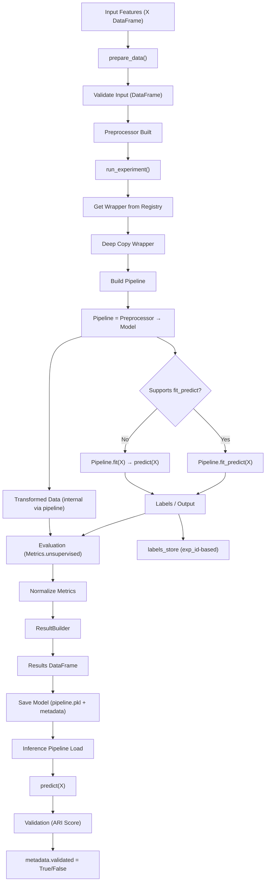

# UnsupervisedModelUtility Documentation

## ✅ Overview

`UnsupervisedModelUtility` is a high-level orchestration layer designed to manage the complete lifecycle of unsupervised machine learning workflows.

It ensures:

- Consistent preprocessing
- Standardized model execution
- Clean result generation
- Separation of visualization artifacts (labels)

---

## 🧱 Architecture Flow



---

## ✅ Key Responsibilities

- ✅ Manages unsupervised ML lifecycle (clustering & dimensionality reduction)
- ✅ Accepts pre-prepared feature data (X DataFrame) — no raw dataset handling
  ✅ Builds pipeline-driven preprocessing via Preprocessor (no external transformation)
- ✅ Executes models using wrapper abstraction + sklearn pipeline (fit_predict / predict)
- ✅ Computes unsupervised metrics via Metrics.unsupervised (e.g., silhouette, etc.)
- ✅ Stores labels separately (labels_store) for visualization and validation
- ✅ Standardizes outputs via ResultBuilder
- ✅ Stores experiment results and trained pipelines
- ✅ Persists models as pipeline.pkl + metadata.json
- ✅ Validates inference pipeline using cluster-safe comparison (ARI score)
- ✅ Supports metadata-driven deployment readiness

---

## ⚙️ Constructor

```python
um = UnsupervisedModelUtility(
    X=X,imputer=imputer,outlier_handler=outlier
)

```

---

## ✅ Internal State

| Attribute      | Description                                                |
| -------------- | ---------------------------------------------------------- |
| X              | Input feature dataset (DataFrame)                          |
| feature_names  | Column names for inference consistency                     |
| preprocessor   | Built preprocessing pipeline (pipeline-first)              |
| results        | Stores experiment outputs                                  |
| labels_store   | Stores model labels separately (keyed by exp_id)           |
| registry       | ModelRegistry instance                                     |
| trained_models | Stores wrapper/pipeline + result for reuse and persistence |

---

## ✅ Data Preparation

```python
um.prepare_data()
```

### Behavior

- No target column required
- No train/test split
- Builds preprocessing pipeline in unsupervised mode

---

## ✅ Run Single Experiment

```python
um.run_experiment("KMeans")
```

### Steps

1. Fetch model from registry
2. Build pipeline
3. Fit + Predict
4. Evaluate metrics
5. Normalize metrics
6. Store result

---

## ✅ Metrics Handling

- Uses `Metrics.unsupervised`
- Filters only scalar metrics for results

---

## ✅ Result Structure

```python
{
  "model": "KMeans",
  "family": "clustering",
  "result_type": "unsupervised",
  "silhouette_score": 0.72,
  "n_clusters": 3
}
```

---

## ✅ Labels Handling

Labels are NOT stored inside results.

```python
labels = um.get_labels("KMeans")
```

Used for visualization.

---

## ✅ Run Multiple Models

```python
um.run_all_models(["KMeans", "DBSCAN"])
```

---

## ✅ Get Results

```python
results_df = um.get_results_df()
```

---

## ✅ Design Principles

- Pipeline-first architecture
- Separation of concerns (results vs visualization)
- Consistency with classification utility
- Registry-driven execution
- Clean and scalable

---

## ✅ Final Takeaway

> `UnsupervisedModelUtility` provides a standardized, scalable, and production-ready framework for executing unsupervised machine learning workflows with clean outputs and strong architectural consistency.
