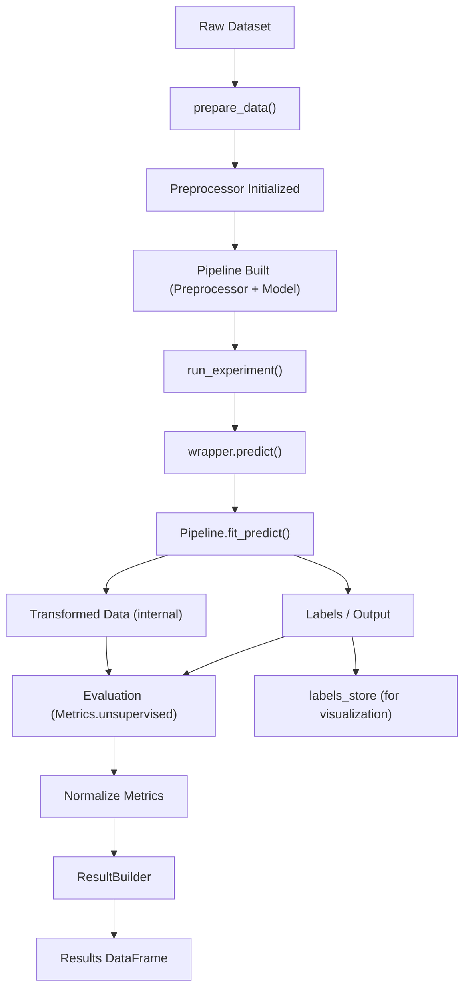

# UnsupervisedModelUtility Documentation

## ✅ Overview

`UnsupervisedModelUtility` is a high-level orchestration layer designed to manage the complete lifecycle of unsupervised machine learning workflows.

It ensures:

- Consistent preprocessing
- Standardized model execution
- Clean result generation
- Separation of visualization artifacts (labels)

---

## 🧱 Architecture Flow



---

## ✅ Key Responsibilities

- Manage unsupervised ML lifecycle
- Build preprocessing pipeline
- Execute clustering/dimensionality models
- Standardize outputs via ResultBuilder
- Store labels separately for visualization

---

## ⚙️ Constructor

```python
UnsupervisedModelUtility(df, imputer=None, outlier_handler=None)
```

---

## ✅ Internal State

| Attribute    | Description                    |
| ------------ | ------------------------------ |
| df           | Raw dataset                    |
| X            | Working dataset                |
| preprocessor | Built preprocessing pipeline   |
| results      | Stores experiment outputs      |
| labels_store | Stores model labels separately |
| registry     | ModelRegistry instance         |

---

## ✅ Data Preparation

```python
um.prepare_data()
```

### Behavior

- No target column required
- No train/test split
- Builds preprocessing pipeline in unsupervised mode

---

## ✅ Run Single Experiment

```python
um.run_experiment("KMeans")
```

### Steps

1. Fetch model from registry
2. Build pipeline
3. Fit + Predict
4. Evaluate metrics
5. Normalize metrics
6. Store result

---

## ✅ Metrics Handling

- Uses `Metrics.unsupervised`
- Filters only scalar metrics for results

---

## ✅ Result Structure

```python
{
  "model": "KMeans",
  "family": "clustering",
  "result_type": "unsupervised",
  "silhouette_score": 0.72,
  "n_clusters": 3
}
```

---

## ✅ Labels Handling

Labels are NOT stored inside results.

```python
labels = um.get_labels("KMeans")
```

Used for visualization.

---

## ✅ Run Multiple Models

```python
um.run_all_models(["KMeans", "DBSCAN"])
```

---

## ✅ Get Results

```python
results_df = um.get_results_df()
```

---

## ✅ Design Principles

- Pipeline-first architecture
- Separation of concerns (results vs visualization)
- Consistency with classification utility
- Registry-driven execution
- Clean and scalable

---

## ✅ Final Takeaway

> `UnsupervisedModelUtility` provides a standardized, scalable, and production-ready framework for executing unsupervised machine learning workflows with clean outputs and strong architectural consistency.
