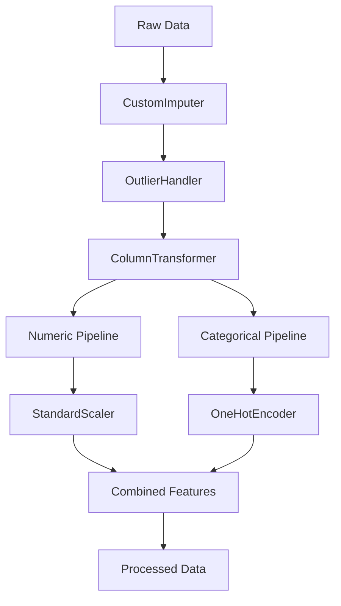

# Preprocessor (Updated Documentation)

## ✅ Overview

`Preprocessor` is a **central pipeline builder** that ensures consistent feature preparation across all models.

---

## 🧱 Updated Architecture Flow



---

## ✅ Key Responsibilities (Refactored)

- Pipeline creation (NOT transformation itself)
- Integration of preprocessing components
- Separation of numeric & categorical logic
- Ensure pipeline compatibility

---

## ⚙️ Constructor

```python
Preprocessor(X, imputer=None, outlier_handler=None)
```

---

## 🔧 Build Method

```python
pipeline = preprocessor.build()
```

---

## 🔍 Pipeline Steps (Updated)

### 1. Optional Steps

```
CustomImputer → OutlierHandler
```

### 2. ColumnTransformer

- Numeric → StandardScaler
- Categorical → OneHotEncoder

---

## ✅ Column Detection (Improved)

```
include="number"
include=["object", "category", "string"]
```

---

## ✅ Output

Returns:

```
sklearn.pipeline.Pipeline
```

Used inside Wrapper:

```
wrapper.build_pipeline(preprocessor)
```

---

## ✅ Framework Integration

Used in:

- ClassificationModelUtility
- LinearModelUtility
- ExperimentRunner

---

## ✅ Design Principles (Updated)

- ✅ Wrapper-driven design
- ✅ Separation from model logic
- ✅ Reusable pipeline
- ✅ No data leakage
- ✅ Plug-and-play components

---

## ⚠️ Best Practices

- Fit only on training data
- Always pass same pipeline to wrapper
- Keep steps modular
- Avoid heavy transformations

---

## ✅ Final Summary

`Preprocessor` is the **foundation of your ML pipeline**, ensuring consistent, reusable, and production-ready feature processing.
