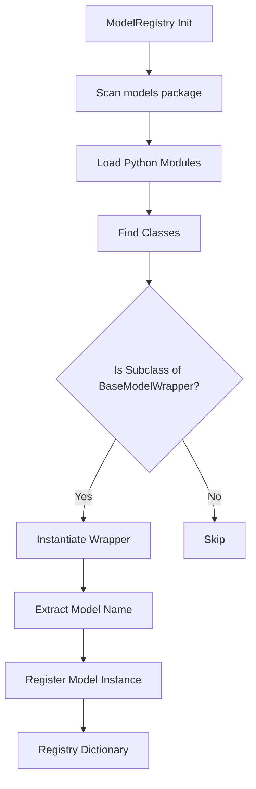

# ModelRegistry – Detailed Documentation

## Overview

The `ModelRegistry` class provides a **dynamic auto-discovery mechanism** for all machine learning model wrappers within the framework. It automatically scans, loads, and registers eligible model wrapper classes from the `models` package.

---

## Purpose

- Automatically discover all model wrappers
- Eliminate manual model registration
- Provide centralized access to models
- Enable extensibility (plug-and-play models)

---

## MODEL REGISTRY & WRAPPER DISCOVERY



---

## ✅ Key Responsibilities (Refactored)

- Discover wrapper classes dynamically
- Instantiate wrapper objects
- Store models by name
- Support task-based retrieval

---

## ✅ Important Enhancements

### ✔ Wrapper-Based Design Alignment

```
ModelRegistry → Wrapper → build_pipeline() → Utility
```

### ✔ Family & Task Awareness

Wrappers now expose:

```
wrapper.task → classification / regression
wrapper.family → linear / tree / boosting
```

---

## ✅ Core Methods

### get_model(model_name)

Returns a deep-copy safe wrapper

---

### get_all_models()

Returns complete registry

---

### get_models_by_task(task)

```python
registry.get_models_by_task("regression")
```

---

## ✅ Output Structure

```
{
  "Ridge": RidgeWrapper(),
  "ElasticNet": ElasticNetWrapper()
}
```

---

## ✅ Design Principles

- ✅ Reflection-based discovery
- ✅ No hardcoded model registration
- ✅ Extensible architecture
- ✅ Task-aware filtering

---

## ✅ Best Practices

- All models must inherit BaseModelWrapper
- Always define task & family
- Use Wrapper naming convention (XYZWrapper)

---

## ✅ Final Summary

`ModelRegistry` is the **foundation for AutoML-ready model extensibility**, enabling seamless addition of new models.
