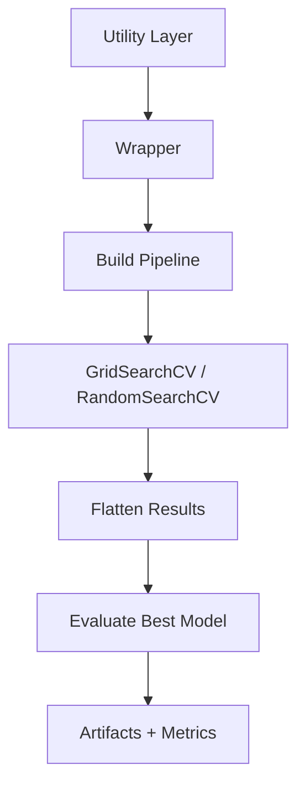

# ClassificationHyperparameterTuner Documentation

## ✅ Overview

`ClassificationHyperparameterTuner` is a **wrapper-aligned hyperparameter tuning engine** designed specifically for classification pipelines.

It supports:

- ✅ Grid Search
- ✅ Random Search
- ✅ Baseline (no tuning)
- ✅ Wrapper-driven evaluation
- ✅ Artifact-aware outputs
- ✅ Experiment tracking

---

## 🧱 Architecture Alignment



---

## 🚀 Initialization

```python
ClassificationHyperparameterTuner(X_train, y_train, X_test=None, y_test=None)
```

### Parameters

- `X_train`: Training features
- `y_train`: Training labels
- `X_test`: Optional test features
- `y_test`: Optional test labels

---

## ✅ Main Entry: tune()

```python
tune(wrapper, model_name, search_type="grid", param_config=None, **kwargs)
```

### Key Behavior

- Accepts **wrapper (NOT pipeline)** ✅
- Builds pipeline via `wrapper.get_pipeline()`
- Supports dynamic param generation
- Routes to grid / random / no-tuning

---

## 🔍 Grid Search

```python
_grid_search(wrapper, pipeline, model_name, param_grid)
```

### Defaults

```python
scoring = "accuracy"
cv = 5
n_jobs = -1
```

---

## 🎲 Random Search

```python
_random_search(wrapper, pipeline, model_name, param_dist)
```

### Additional

```python
n_iter = 20
random_state = 42
```

---

## 📊 Result Processing

```python
_process_results(wrapper, search_obj, model_name, mode, search_type)
```

### Steps

1. Flatten CV results (`DataCleaner`)
2. Build experiment name (`Formatter`)
3. Enrich rows with:

```
experiment
type
search_type
iteration
task
family
```

4. Append best result
5. Sort by score

---

## 🏆 Best Result Handling

```python
_build_best_result()
```

### Includes

- `best_score_cv`
- `param_*`
- Evaluation on test data

---

## 📈 Evaluation Flow

```python
wrapper.evaluate(y_test, y_pred, y_proba)
```

### Outputs

- Metrics
- Artifacts (ROC, PR, Confusion Matrix)

---

## 📦 Output Structure

Each row:

```python
{
    "model": str,
    "experiment": str,
    "mode": str,
    "type": "tuned",
    "search_type": str,
    "score": float,
    "param_*": value,
    "task": "classification",
    "family": str
}
```

---

## ⚙️ Baseline Mode

```python
search_type = "none"
```

✔ Trains model without tuning
✔ Direct evaluation

---

## 🧠 Design Principles

- ✅ Wrapper-first approach
- ✅ Classification-specific tuning
- ✅ Separation of metrics & artifacts
- ✅ Flattened output (visualization-ready)
- ✅ Fault-tolerant execution

---

## ✅ Best Practices

- Always use wrapper.get_pipeline()
- Avoid passing raw estimators
- Use appropriate scoring (accuracy, f1)
- Validate param grids

---

## ✅ Final Summary

`ClassificationHyperparameterTuner` provides a **robust, extensible, and production-ready tuning system** aligned with your ML framework architecture.
