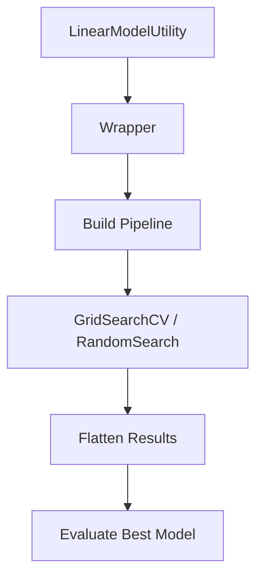

# HyperparameterTuner - Comprehensive Documentation

## 📌 Overview

The `HyperparameterTuner` is a **production-grade hyperparameter optimization engine** designed for modern ML systems.

It supports:

- ✅ Grid Search (exhaustive search)
- ✅ Random Search (probabilistic search)
- ✅ Experiment-level tracking
- ✅ AutoML-ready integration
- ✅ Visualization-ready outputs (flattened, row-based)

---

## 🧱 Architecture Flow



---

## ✅ Responsibilities (Refactored)

- Perform tuning using wrapper pipelines
- Enforce regression scoring
- Flatten CV results
- Attach experiment metadata
- Evaluate best model using wrapper

---

## 🔧 Methods

### grid_search(wrapper, model_name, param_grid)

### random_search(wrapper, model_name, param_dist)

---

## ✅ Output Structure

Each row:

```
model
experiment
mode (grid/random)
type (tuned)
best_score_cv
param_*
```

---

## ✅ Supported Scoring

- neg_mean_squared_error ✅
- neg_root_mean_squared_error
- r2

---

## ✅ Design Principles

- ✅ Wrapper-driven execution
- ✅ Regression-only scoring
- ✅ Flat output format
- ✅ Visualization-ready

---

## ✅ Final Summary

`HyperparameterTuner` ensures **correct regression tuning**, fixing critical scoring issues and enabling full AutoML workflows.
